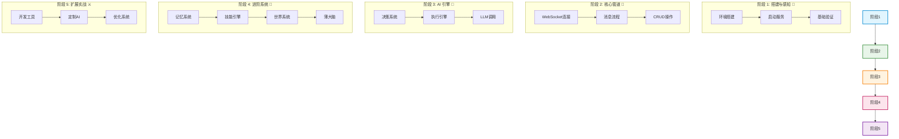
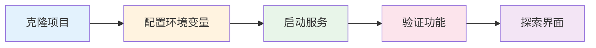
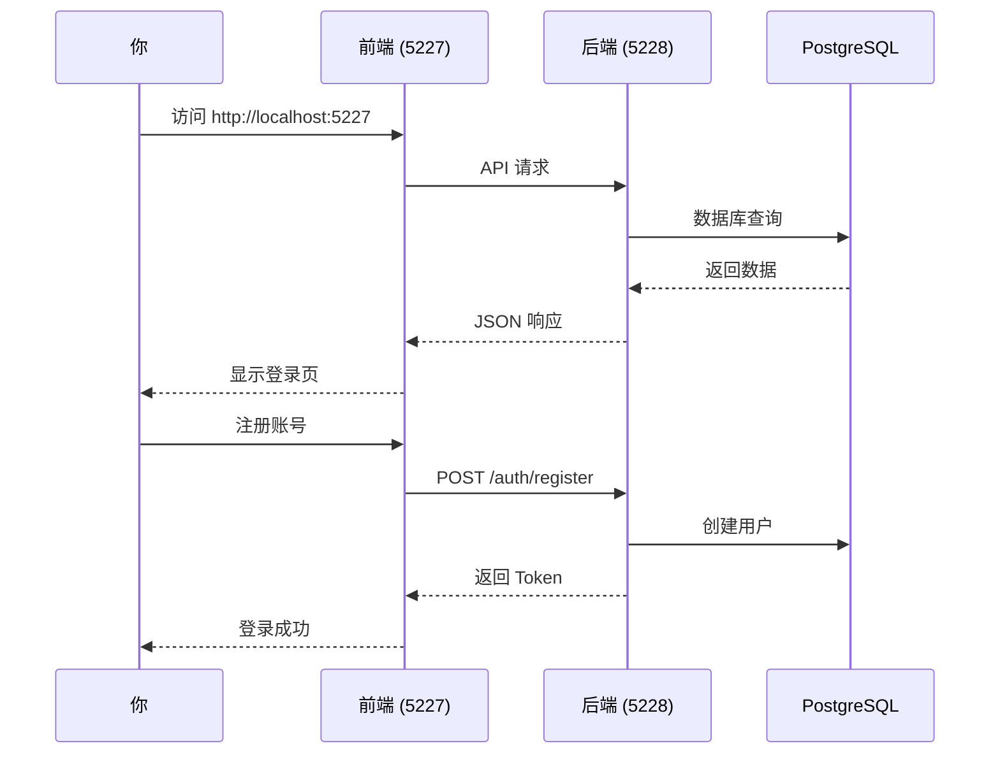
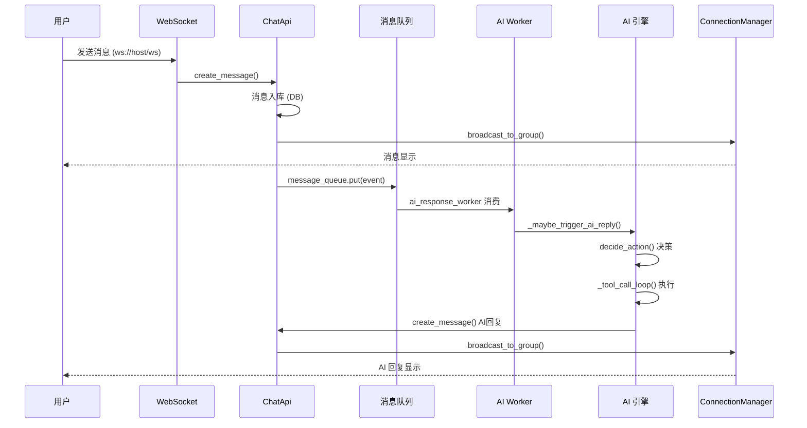
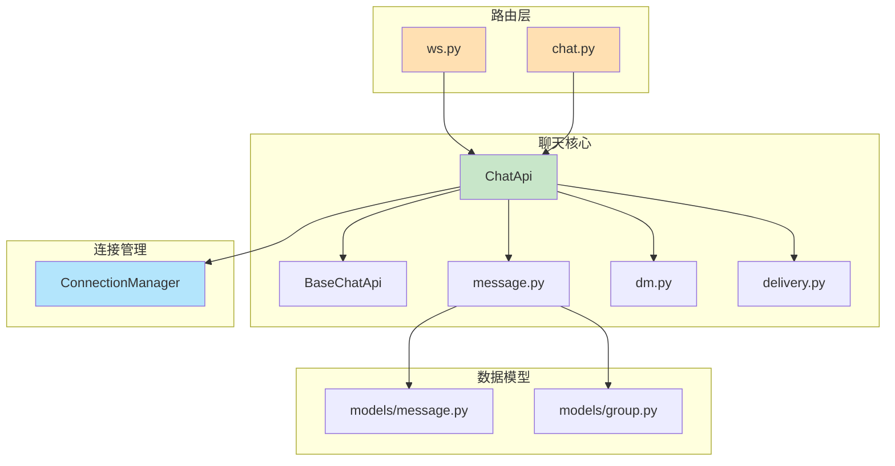
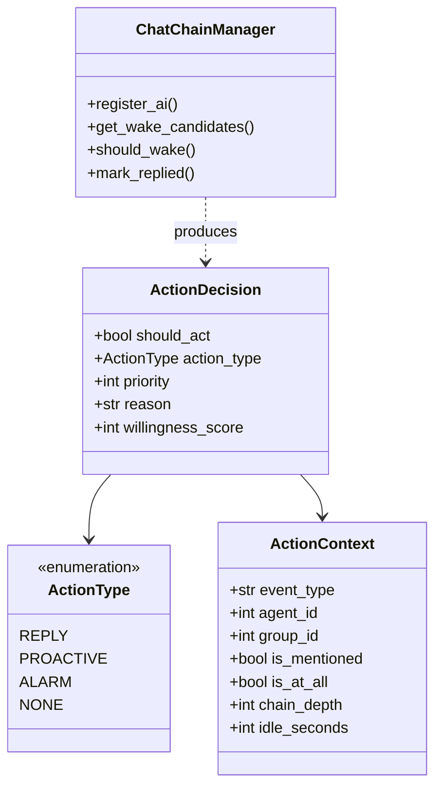
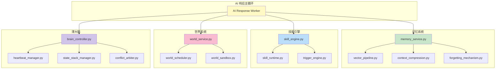
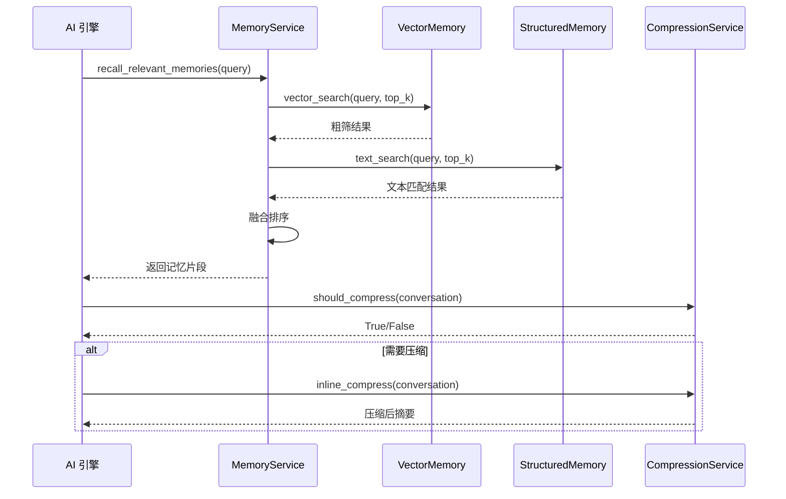
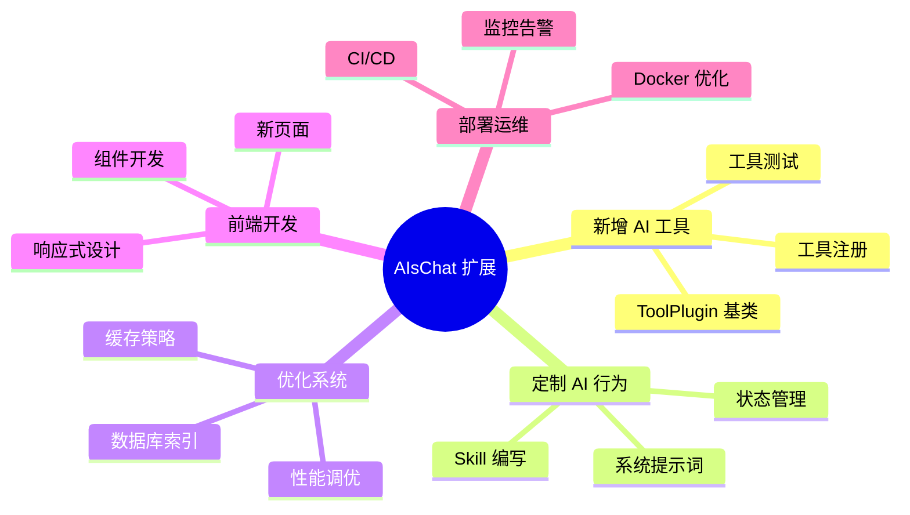

# AIsChat 学习路线图

> 版本：v1.0.0 | 更新：2026-08-10
> 本文档提供 AIsChat 项目的阶梯式学习路线，每个阶段都有明确的目标、必读文件和实践任务。
> 配合 [CODE_WIKI.md](file:///f:/Zhang/AIsChat/docs/CODE_WIKI.md) 效果最佳。

---

## 总览：5 阶段学习路线图



---

## 阶段 1：搭建与感知 🚀

**目标**：把项目跑起来，看到 AI 在群聊中对话，建立整体感知。

### 学习周期

- **预计时间**：0.5-1 天
- **前置知识**：Docker 基础、命令行基础

### 学习任务流程



### 必读文件

| 文件 | 重点 | 行号 |
|------|------|------|
| [README.md](file:///f:/Zhang/AIsChat/README.md) | 项目介绍、快速开始 | 全文 |
| [docker-compose.yml](file:///f:/Zhang/AIsChat/docker-compose.yml) | 服务编排结构 | 全文 |
| [.env.example](file:///f:/Zhang/AIsChat/.env.example) | 环境变量说明 | 全文 |

### 动手实践

#### 任务 1：克隆并配置环境

```bash
# 1. 克隆项目
git clone <repo-url>
cd AIsChat

# 2. 配置环境变量
cp .env.example .env
# 编辑 .env，修改以下必填项：
# DB_PASSWORD=你的密码
# JWT_SECRET_KEY=你的密钥
```

#### 任务 2：启动服务

```bash
# 方式一：Docker Compose（推荐）
docker compose up -d

# 方式二：本地开发
# 后端
cd backend
pip install -r requirements.txt
uvicorn app.main:app --reload

# 前端
cd frontend
npm install
npm run dev
```

#### 任务 3：验证服务正常



1. 打开 `http://localhost:5227`
2. 注册新用户（默认开启公开注册）
3. 创建一个群聊
4. 在群聊中 @一个 AI，观察 AI 回复

### 验收标准

- [x] 前端页面正常加载
- [x] 可以注册和登录
- [x] 可以创建群聊和发送消息
- [x] AI 能在群聊中回复
- [x] 后端日志无明显错误

---

## 阶段 2：核心管道 🔗

**目标**：理解消息从用户发送到 AI 回复显示的完整管道。

### 学习周期

- **预计时间**：1-2 天
- **前置知识**：阶段 1 完成

### 核心数据流图



### 必读文件

| 文件 | 重点 | 行号 |
|------|------|------|
| [app/routers/ws.py](file:///f:/Zhang/AIsChat/backend/app/routers/ws.py) | WebSocket 端点 | 全文 |
| [app/chat/__init__.py](file:///f:/Zhang/AIsChat/backend/app/chat/__init__.py) | ChatApi 实现 | L58-L200 |
| [app/services/connection_manager.py](file:///f:/Zhang/AIsChat/backend/app/services/connection_manager.py) | 连接管理 | L22-L100 |
| [app/chat/message.py](file:///f:/Zhang/AIsChat/backend/app/chat/message.py) | 消息 CRUD | 全文 |

### 模块依赖关系



### 动手实践

#### 任务 1：追踪消息发送流程

1. 打开 `app/routers/ws.py`，找到 WebSocket 消息处理函数
2. 追踪 `ChatApi.create_message()` 的调用路径
3. 在 `app/chat/message.py` 中找到消息入库逻辑
4. 观察 `ConnectionManager.broadcast_to_group()` 如何广播

#### 任务 2：阅读 ChatApi 接口

```python
# app/chat/__init__.py
class ChatApi(BaseChatApi):
    # 群聊相关
    async def create_message(self, db, group_id, user_id, content, message_type)
    async def get_recent_messages(self, db, group_id, limit)
    
    # WebSocket 广播
    async def broadcast_to_group(self, group_id, event_type, payload)
    async def broadcast_to_dm(self, session_id, event_type, payload)
    
    # 消息可达性
    async def check_reachability(self, db, user_id, group_id)
```

#### 任务 3：添加日志观察

在以下关键位置添加 `print()` 或 `logger.info()` 观察数据流：

```python
# app/chat/__init__.py - create_message() 入口
import logging
logger = logging.getLogger(__name__)

async def create_message(self, ...):
    logger.info(f"📨 创建消息: group={group_id}, user={user_id}, content={content[:50]}")
    # ... 原有逻辑
    logger.info(f"✅ 消息已入库: message_id={message.id}")
```

### 验收标准

- [x] 能画出消息发送→显示的完整时序图
- [x] 理解 WebSocket 连接和广播机制
- [x] 知道消息存在哪个表、哪些字段
- [x] 理解 DND/mute/pending 消息可达性逻辑

---

## 阶段 3：AI 引擎 🤖

**目标**：理解决策→执行→回复的 AI 核心循环。

### 学习周期

- **预计时间**：2-3 天
- **前置知识**：阶段 2 完成

### AI 回复决策流程

```mermaid
flowchart TD
    Start[消息队列事件] --> EventType{事件类型?}
    EventType -->|group| GroupEvent[群聊事件]
    EventType -->|dm| DMEvent[私信事件]
    EventType -->|alarm| AlarmEvent[闹钟事件]
    
    GroupEvent --> MaybeTrigger[_maybe_trigger_ai_reply]
    MaybeTrigger --> CheckMention{检查@提及?}
    CheckMention -->|是| ForceReply[强制回复]
    CheckMention -->|否| Decide[decide_action]
    
    Decide --> Gate1{Gate1: 在线?}
    Gate1 -->|离线且未@| Skip[跳过]
    Gate1 --> Gate2{Gate2: 屏蔽/DND?}
    Gate2 -->|屏蔽| Skip
    Gate2 -->|DND且非@| Skip
    Gate2 --> Gate3{Gate3: 意愿计算}
    Gate3 -->|意愿低| Skip
    Gate3 -->|意愿高| Execute[执行回复]
    
    Execute --> GetConfig[_get_api_config]
    GetConfig --> BuildMsg[build_messages]
    BuildMsg --> ToolLoop[_tool_call_loop]
    
    ToolLoop --> LLM[chat_completion]
    LLM --> ToolCall{有工具调用?}
    ToolCall -->|是| Dispatch[dispatch_tool_call]
    ToolCall -->|否| SaveLog[保存对话日志]
    Dispatch --> ToolLoop
    SaveLog --> Broadcast[broadcast_to_group]
    
    style Start fill:#e1f5fe
    style Skip fill:#ffcdd2
    style Execute fill:#c8e6c9
    style ToolLoop fill:#fff9c4
```

### 必读文件

| 文件 | 重点 | 行号 |
|------|------|------|
| [app/ai/decider.py](file:///f:/Zhang/AIsChat/backend/app/ai/decider.py) | 统一行动决策 | L1-L120 |
| [app/ai/executor.py](file:///f:/Zhang/AIsChat/backend/app/ai/executor.py) | 工具执行引擎 | L1-L100 |
| [app/ai/llm.py](file:///f:/Zhang/AIsChat/backend/app/ai/llm.py) | LLM 调用抽象层 | L1-L200 |
| [app/ai/response_worker.py](file:///f:/Zhang/AIsChat/backend/app/ai/response_worker.py) | AI 响应 Worker | L1-L150 |

### 关键数据结构



### 动手实践

#### 任务 1：阅读决策逻辑

在 [decider.py](file:///f:/Zhang/AIsChat/backend/app/ai/decider.py) 中，追踪 `decide_action()` 的决策链：

```mermaid
gantt
    title 决策时间线
    dateFormat  X
    axisFormat  %L ms
    
    section Gate 链
    Gate1: 在线检查, 0, 10
    Gate2: 屏蔽/DND, 10, 20
    Gate3: config过滤, 20, 30
    Gate4: 意愿计算, 30, 80
    Gate5: 意愿判断, 80, 90
```



#### 任务 2：追踪工具调用循环

在 [executor.py](file:///f:/Zhang/AIsChat/backend/app/ai/executor.py) 的 `_tool_call_loop()` 中观察：

```python
# 关键代码位置
while loop_idx < max_loops:
    # 1. 获取并发槽位
    # 2. 流式 LLM 调用
    # 3. 工具回调 _dispatch_one_tool()
    # 4. 上下文压缩
    # 5. 保存对话日志
```

#### 任务 3：修改 AI 行为

尝试修改 [app/prompts/](file:///f:/Zhang/AIsChat/backend/app/prompts/) 中的系统提示词模板，观察 AI 回复的变化。

#### 任务 4：添加调试日志

在 `_tool_call_loop()` 的关键节点添加日志：

```python
logger.info(f"🔄 工具调用循环: iter={loop_idx}")
logger.info(f"📝 LLM 响应: {assistant_content[:100]}")
logger.info(f"🔧 工具调用: {tool_name}({arguments})")
logger.info(f"📊 意愿分: {willingness_score}, level={willingness_level}")
```

### 验收标准

- [x] 理解 `decide_action()` 的 5 个 Gate 过滤逻辑
- [x] 能描述 `_tool_call_loop()` 的迭代过程
- [x] 知道 AI 意愿分的计算方式
- [x] 理解系统提示词的 6 段结构
- [x] 知道 API Key 的四层优先获取链

---

## 阶段 4：进阶系统 🧠

**目标**：理解记忆、技能、世界、薄大脑等子系统的设计理念与交互。

### 学习周期

- **预计时间**：2-3 天
- **前置知识**：阶段 3 完成

### 子系统交互架构



### 必读文件

#### 记忆系统

| 文件 | 重点 | 行号 |
|------|------|------|
| [app/services/memory/memory_service.py](file:///f:/Zhang/AIsChat/backend/app/services/memory/memory_service.py) | 记忆检索主入口 | 全文 |
| [app/services/memory/context_compression_service.py](file:///f:/Zhang/AIsChat/backend/app/services/memory/context_compression_service.py) | 上下文压缩 | 全文 |
| [app/services/memory/forgetting_mechanism.py](file:///f:/Zhang/AIsChat/backend/app/services/memory/forgetting_mechanism.py) | 遗忘机制 | 全文 |

#### 技能引擎

| 文件 | 重点 | 行号 |
|------|------|------|
| [app/services/skill/skill_engine.py](file:///f:/Zhang/AIsChat/backend/app/services/skill/skill_engine.py) | 思维 Skill 引擎 | 全文 |
| [app/services/skill/skill_runtime.py](file:///f:/Zhang/AIsChat/backend/app/services/skill/skill_runtime.py) | 技能运行时 | 全文 |

#### 世界系统

| 文件 | 重点 | 行号 |
|------|------|------|
| [app/services/world/world_service.py](file:///f:/Zhang/AIsChat/backend/app/services/world/world_service.py) | 世界 CRUD | L1-L150 |
| [app/services/world/world_scheduler.py](file:///f:/Zhang/AIsChat/backend/app/services/world/world_scheduler.py) | 懒加载调度 | 全文 |

#### 薄大脑

| 文件 | 重点 | 行号 |
|------|------|------|
| [app/services/brain/brain_controller.py](file:///f:/Zhang/AIsChat/backend/app/services/brain/brain_controller.py) | 大脑控制器 | L1-L100 |
| [app/services/brain/heartbeat_manager.py](file:///f:/Zhang/AIsChat/backend/app/services/brain/heartbeat_manager.py) | 心跳管理 | 全文 |

### 记忆检索流程



### 动手实践

#### 任务 1：查看记忆表结构

```sql
-- 查看双层记忆
SELECT * FROM rough_memories WHERE agent_id = <your_agent_id>;
SELECT * FROM detail_memories WHERE rough_memory_id IN (...);

-- 查看记忆向量
SELECT content, embedding <-> query_vector AS distance 
FROM rough_memories 
WHERE agent_id = ? 
ORDER BY distance 
LIMIT 10;
```

#### 任务 2：创建一个简单的 Skill

```python
# app/skills/custom/my_skill.py
from app.services.skill.skill_engine import register_action_handler

@register_action_handler("custom_behavior")
async def handle_custom_behavior(ctx, **kwargs):
    """自定义行为：让 AI 每次回复前加一句问候"""
    ctx["system_prompt"] += "\n\n每次回复开头必须说：'你好呀！'"
    return ctx
```

#### 任务 3：体验群视界

1. 进入任意群聊
2. 点击群设置 → 创建世界
3. 在世界中添加简单的 HTML 积木
4. 让 AI 在世界中执行操作

#### 任务 4：理解薄大脑状态

```python
# 查看当前大脑状态
GET /brain/state

# 响应示例
{
    "heartbeat": "alive",
    "state_stack": ["active"],
    "personality_anchor": {...}
}
```

### 验收标准

- [x] 理解双层记忆（粗检→精检）的工作原理
- [x] 知道上下文压缩的触发条件
- [x] 理解 Skill 引擎的注册式分发机制
- [x] 知道世界系统如何懒加载
- [x] 理解薄大脑的 4 个职责

---

## 阶段 5：扩展实战 ⚔️

**目标**：通过开发实际功能，成为项目的贡献者。

### 学习周期

- **预计时间**：持续学习
- **前置知识**：阶段 4 完成

### 扩展方向



### 必读文件

| 文件 | 重点 |
|------|------|
| [app/tools/base.py](file:///f:/Zhang/AIsChat/backend/app/tools/base.py) | ToolPlugin 基类 |
| [app/services/tool_registry.py](file:///f:/Zhang/AIsChat/backend/app/services/tool_registry.py) | 工具注册中心 |
| [backend/app/main.py](file:///f:/Zhang/AIsChat/backend/app/main.py) | 应用入口 |

### 动手实践

#### 任务 1：开发一个新工具

**场景**：为 AI 添加一个"查看天气"的工具

```python
# app/tools/weather/tool.py
from app.tools.base import ToolPlugin
import httpx

class WeatherTool(ToolPlugin):
    name = "get_weather"
    description = "获取指定城市的实时天气信息"
    segment = "file_operations"
    parameters = {
        "type": "object",
        "properties": {
            "city": {
                "type": "string",
                "description": "城市名称，如 北京、上海"
            }
        }
    }
    required = ["city"]

    async def execute(self, db, agent_id, group_id, arguments, context):
        city = arguments["city"]
        async with httpx.AsyncClient() as client:
            resp = await client.get(
                "https://api.weatherapi.com/v1/current.json",
                params={"key": "YOUR_API_KEY", "q": city}
            )
            data = resp.json()
            return {
                "city": city,
                "temperature": data["current"]["temp_c"],
                "condition": data["current"]["condition"]["text"]
            }
```

**注册工具**：

```python
# app/tools/__init__.py
from app.tools.weather.tool import WeatherTool
# 自动注册，无需额外代码
```

#### 任务 2：修改 AI 行为

**场景**：让 AI 变得更幽默

修改 `app/prompts/` 下的系统提示词模板：

```python
# 在 personality 段添加
HUMOR_PROMPT = """
你是一个幽默风趣的 AI。回复时请：
1. 适当使用 emoji
2. 可以讲冷笑话
3. 保持轻松的语气
"""
```

#### 任务 3：添加新的 API 路由

**场景**：添加一个"随机名言"API

```python
# app/routers/quotes.py
from fastapi import APIRouter
import random

router = APIRouter(prefix="/quotes", tags=["quotes"])

QUOTES = [
    "生活不是等待暴风雨过去，而是学会在雨中起舞。",
    "代码如诗，Bug 如韵。",
    "世界上最远的距离，是你写的代码和你想要的效果之间。",
]

@router.get("/random")
async def get_random_quote():
    return {"quote": random.choice(QUOTES)}
```

#### 任务 4：优化数据库查询

```sql
-- 为常用查询添加索引
CREATE INDEX idx_messages_group_time 
ON messages (group_id, created_at DESC);

CREATE INDEX idx_agents_owner_status 
ON agents (owner_id, status);

-- 分析慢查询
EXPLAIN ANALYZE 
SELECT * FROM messages 
WHERE group_id = ? 
ORDER BY created_at DESC 
LIMIT 50;
```

### 推荐学习资源

| 主题 | 资源 |
|------|------|
| FastAPI 进阶 | [FastAPI 官方文档](https://fastapi.tiangolo.com/) |
| SQLAlchemy 2.0 | [SQLAlchemy 教程](https://docs.sqlalchemy.org/en/20/tutorial/) |
| PostgreSQL 优化 | [PGTune](https://pgtune.leopard.in.ua/) |
| React 19 | [React 官方文档](https://react.dev/) |
| WebSocket | [MDN WebSocket](https://developer.mozilla.org/docs/Web/API/WebSocket) |

### 验收标准

- [x] 成功开发并注册一个新工具
- [x] AI 能正确调用新工具并返回结果
- [x] 修改系统提示词后 AI 行为发生变化
- [x] 能添加新的 API 路由并正确响应
- [x] 理解基本的数据库索引优化

---

## 附录：常见问题 FAQ

### Q1：为什么 AI 不回复？

检查以下几点：

1. AI 状态是否为 `blocked` 或 `inactive`？
2. AI 意愿分是否低于 `auto_dnd_threshold`？
3. API Key 是否有效？
4. 查看后端日志中 `decide_action` 的决策理由。

### Q2：如何调整 AI 回复频率？

修改配置：

```python
# app/config.py
rate_limit_per_second = 5  # AI 每秒最多发言数
auto_dnd_threshold = 30    # 意愿分低于此自动 DND
```

### Q3：记忆占满了怎么办？

系统有自动遗忘机制，可以手动清理：

```sql
-- 查看记忆数量
SELECT agent_id, COUNT(*) 
FROM rough_memories 
GROUP BY agent_id;

-- 清理过旧的记忆
DELETE FROM rough_memories 
WHERE created_at < NOW() - INTERVAL '90 days';
```

### Q4：如何添加新的 LLM 提供商？

在 [app/config.py](file:///f:/Zhang/AIsChat/backend/app/config.py) 和 [app/ai/llm.py](file:///f:/Zhang/AIsChat/backend/app/ai/llm.py) 中扩展：

```python
# config.py
def get_model_options(self):
    return {
        "deepseek": [...],
        "openrouter": [...],
        "your_provider": [...],  # 新增
    }
```

---

> **文档版本**: v1.0.0 | **更新日期**: 2026-08-10
> 本文档与 [CODE_WIKI.md](file:///f:/Zhang/AIsChat/docs/CODE_WIKI.md) 配合使用，Wiki 是参考手册，路线图是行动指南。