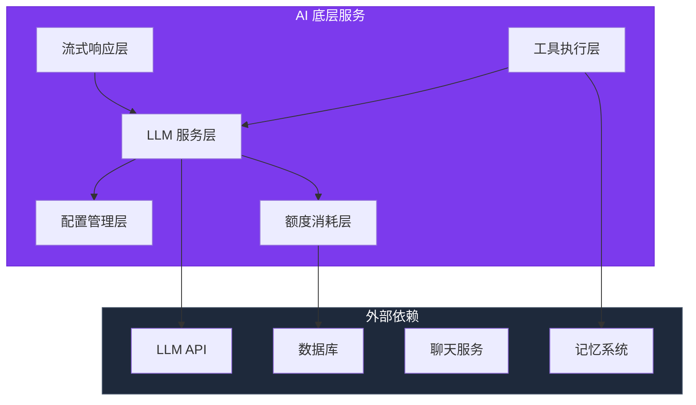
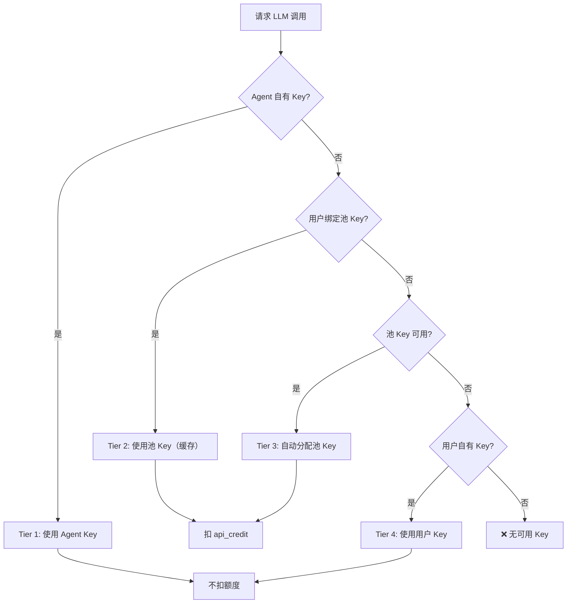
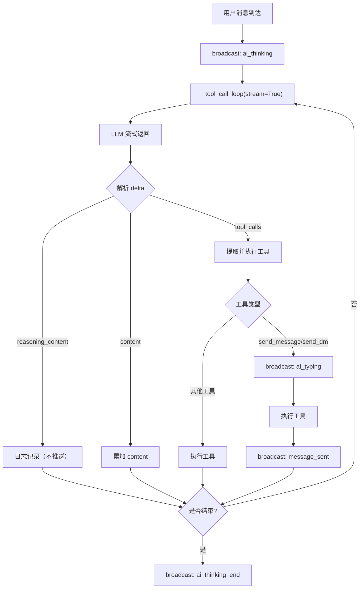

# AI 底层服务设计文档

> **服务定位**：AI 能力的基础设施层，提供 LLM 调用、工具执行、流式响应等核心能力
> **版本**：v1.0
> **日期**：2026-07-23
> **文档规范**：设计类文档统一结构，语言规范，命名规范

---

## 目录

1. [服务架构](#一服务架构)
2. [核心职责](#二核心职责)
3. [LLM 服务层](#三llm-服务层)
4. [工具执行层](#四工具执行层)
5. [流式响应层](#五流式响应层)
6. [配置管理层](#六配置管理层)
7. [额度消耗层](#七额度消耗层)
8. [关键文件索引](#八关键文件索引)
9. [API 端点](#九api-端点)

---

## 一、服务架构



---

## 二、核心职责

| 职责 | 说明 |
|------|------|
| **LLM 调用** | 封装多种 LLM API，统一调用接口 |
| **工具执行** | 工具注册、参数校验、执行调度 |
| **流式响应** | SSE 解析、状态推送、工具调用循环 |
| **配置管理** | AI 配置文件管理、预设档位 |
| **额度消耗** | API Key 池管理、额度扣除、审计日志 |

---

## 三、LLM 服务层

### 3.1 统一调用接口

```python
class LLMService:
    async def chat_completion(
        self,
        agent_id: int,
        messages: list[dict],
        tools: list[dict] | None = None,
        stream: bool = False,
        **kwargs,
    ) -> dict: ...
    
    async def chat_completion_streaming(
        self,
        agent_id: int,
        messages: list[dict],
        tools: list[dict] | None = None,
        **kwargs,
    ) -> AsyncGenerator[dict, None]: ...
```

### 3.2 四层 Key 解析优先链



### 3.3 SSE 流式解析

```python
async def _chat_completion_streaming(self, agent_id, messages, tools=None, **kwargs):
    async with httpx.AsyncClient().stream(
        "POST",
        api_url,
        json=payload,
        timeout=300,
    ) as response:
        buffer = {}
        async for line in response.aiter_lines():
            if not line.startswith("data: "):
                continue
            
            data = json.loads(line[6:])
            if data == "[DONE]":
                break
            
            delta = data["choices"][0]["delta"]
            
            if "reasoning_content" in delta:
                buffer["reasoning_content"] = delta["reasoning_content"]
            
            if "content" in delta:
                buffer["content"] = buffer.get("content", "") + delta["content"]
            
            if "tool_calls" in delta:
                self._merge_tool_calls(buffer, delta["tool_calls"])
            
            yield buffer
```

---

## 四、工具执行层

### 4.1 工具注册机制

```python
class ToolRegistry:
    def register(self, tool: ToolPlugin):
        """注册工具"""
        ...
    
    def get_tool(self, name: str) -> ToolPlugin | None:
        """获取工具"""
        ...
    
    def validate_tool_call(self, tool_name: str, arguments: dict) -> str | None:
        """校验工具调用参数"""
        ...
    
    async def execute_tool(self, agent_id: int, tool_name: str, arguments: dict) -> dict:
        """执行工具"""
        ...
```

### 4.2 工具参数校验

校验顺序：
1. **工具存在性** — 不在注册表中 → 返回错误 + 可用工具列表
2. **必填字段** — 缺少 required 字段 → 返回期望格式 vs 实际收到
3. **字段类型** — 类型不匹配 → 返回字段名 + 期望类型 + 实际类型

---

## 五、流式响应层

### 5.1 工具调用循环



### 5.2 WebSocket 状态事件

| 事件 | 触发时机 | 字段 |
|------|---------|------|
| `ai_thinking` | LLM 调用开始 | agent_id, agent_name, group_id, trigger |
| `ai_typing` | 调用 send_message/send_dm 前 | agent_id, agent_name, group_id, trigger |
| `ai_thinking_end` | 工具调用循环结束 | agent_id, group_id, trigger |

**trigger 字段**：
- `"user"` — 用户触发，前端显示状态
- `"auto"` — 闹钟/心跳触发，前端静默

---

## 六、配置管理层

### 6.1 三档预设

```python
CONFIG_PROFILES = {
    "chat": {
        "name": "聊天档",
        "description": "被动响应 · 低成本",
        "temperature": 0.7,
        "max_tool_rounds": 2,
        "thinking_enabled": False,
    },
    "immersive": {
        "name": "深度沉浸档",
        "description": "半自主 · 按需参与",
        "temperature": 0.9,
        "max_tool_rounds": 4,
        "thinking_enabled": True,
    },
    "digital_life": {
        "name": "数字生命档",
        "description": "持续在线 · 主动行为",
        "temperature": 1.1,
        "max_tool_rounds": 10,
        "thinking_enabled": True,
    },
}
```

### 6.2 AI 配置模型

```python
class AgentConfig(Base):
    agent_id: int
    config_profile: str
    temperature: float
    top_p: float
    presence_penalty: float
    frequency_penalty: float
    thinking_enabled: bool
    max_tool_rounds: int
    alarm_max_tool_rounds: int
    max_alarms: int
    force_alarm_on_end: bool
    delay_reply_enabled: bool
    is_ai_editable: bool
    hide_ai_identity: bool
```

---

## 七、额度消耗层

### 7.1 API Key 池管理

```python
class APIKeyPool:
    async def get_pool_key(self, user_id: int) -> APIKey | None:
        """获取用户绑定的池 Key"""
        ...
    
    async def assign_pool_key(self, user_id: int) -> APIKey:
        """分配新的池 Key"""
        ...
    
    async def deduct_credit(
        self,
        user_id: int,
        agent_id: int,
        tokens_used: int,
        model: str,
    ) -> None:
        """扣除额度"""
        ...
```

### 7.2 消耗规则

| 规则 | 值 | 说明 |
|------|-----|------|
| 兑换比例 | 1 credit = 10,000 tokens | 可配置 |
| 最低扣除 | 0.01 credit / 次 | 防零成本调用 |
| 扣除时机 | LLM 调用结束后 | 不阻塞主流程 |
| 并发保护 | SELECT FOR UPDATE | 防止额度超用 |

---

## 八、关键文件索引

| 文件 | 职责 |
|------|------|
| `backend/app/services/llm_service.py` | LLM 调用封装、SSE 解析 |
| `backend/app/services/tool_registry.py` | 工具注册、参数校验 |
| `backend/app/services/ai_response_worker.py` | 工具调用循环、状态推送 |
| `backend/app/services/api_key_pool_service.py` | API Key 池管理 |
| `backend/app/services/credit_service.py` | 额度消耗、审计日志 |
| `backend/app/tools/` | 工具实现目录 |
| `backend/app/models/agent_config.py` | AI 配置 ORM |
| `backend/app/models/api_key_pool.py` | API Key 池 ORM |
| `backend/app/models/api_usage_log.py` | 审计日志 ORM |

---

## 九、API 端点

| 方法 | 路径 | 说明 |
|------|------|------|
| POST | `/ai/chat` | 触发 AI 回复 |
| POST | `/ai/agents` | 创建 AI |
| GET | `/ai/agents/{id}` | 获取 AI 详情 |
| PUT | `/ai/agents/{id}/config` | 修改 AI 配置 |
| POST | `/ai/agents/{id}/apply-preset` | 应用预设 |
| GET | `/ai/tools` | 获取可用工具列表 |
