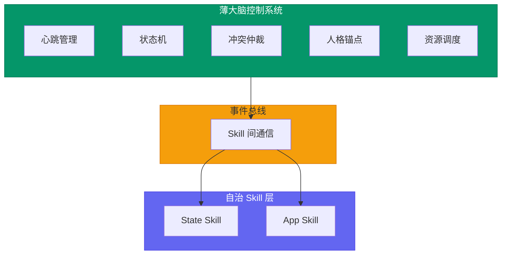
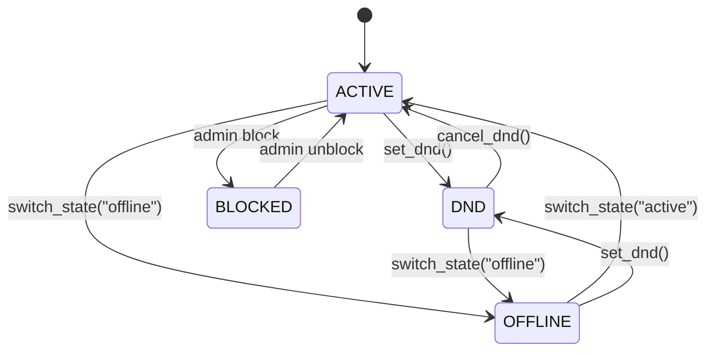

# AI 薄大脑控制系统设计文档

> **服务定位**：极薄大脑，只维持生命体征，不做具体决策，决策下放给各 Skill
> **版本**：v1.0
> **日期**：2026-07-23
> **文档规范**：设计类文档统一结构，语言规范，命名规范

---

## 目录

1. [服务架构](#一服务架构)
2. [核心职责](#二核心职责)
3. [心跳管理](#三心跳管理)
4. [状态机](#四状态机)
5. [冲突仲裁](#五冲突仲裁)
6. [人格锚点](#六人格锚点)
7. [资源调度](#七资源调度)
8. [事件总线](#八事件总线)
9. [关键文件索引](#九关键文件索引)
10. [代码量目标](#十代码量目标)
11. [API 端点](#十一api-端点)

---

## 一、服务架构



---

## 二、核心职责

大脑只做 **4 件事**，多一件都不做：

| 职责 | 说明 | 类比人体 |
|------|------|---------|
| **心跳** | 周期性 self-check，确认自己「活着」 | 心跳/呼吸 |
| **状态保持** | 维护 active/dnd/offline/blocked 全局状态机 | 清醒/睡眠 |
| **冲突仲裁** | 多个 Skill 同时想说话时，决定谁先说、说什么 | 注意力分配 |
| **人格锚点** | 最核心的身份、名字、基本设定（不能被 Skill 修改） | 自我意识 |

### 不做的事

| 不做 | 下放给 |
|------|--------|
| 消息分类 | Skill 自己订阅 |
| 意愿评分 | Skill 的 `should_act` |
| 工具选择 | Skill 的 `act` |
| 记忆管理 | 记忆 State Skill |
| 社交决策 | 社交 Skill |
| 任务规划 | 工作 Skill |

---

## 三、心跳管理

### 3.1 心跳机制

```python
class HeartbeatManager:
    def __init__(self):
        self.heartbeat_interval = 60  # 60秒
        self.last_heartbeat = {}
    
    async def start(self):
        """启动心跳循环"""
        while True:
            await asyncio.sleep(self.heartbeat_interval)
            await self._check_all_agents()
    
    async def _check_all_agents(self):
        """检查所有 AI 的健康状态"""
        for agent_id in self._get_active_agents():
            await self._heartbeat_check(agent_id)
    
    async def _heartbeat_check(self, agent_id: int):
        """单个 AI 心跳检查"""
        try:
            # 检查内存使用
            # 检查 LLM 配额
            # 检查 Skill 状态
            self.last_heartbeat[agent_id] = datetime.now()
        except Exception as e:
            logger.warning(f"Heartbeat failed for agent {agent_id}: {e}")
```

### 3.2 健康状态

```python
class AgentHealth:
    agent_id: int
    status: str              # "healthy" | "warning" | "critical"
    memory_usage: float      # 内存使用百分比
    llm_quota_remaining: float  # 剩余额度百分比
    active_skills: int       # 活跃 Skill 数量
    last_heartbeat: datetime
```

---

## 四、状态机

### 4.1 全局状态

```python
class AgentState(Enum):
    ACTIVE = "active"
    DND = "dnd"
    OFFLINE = "offline"
    BLOCKED = "blocked"
```

### 4.2 状态转换



### 4.3 状态帧管理

```python
class StateFrame:
    id: str
    type: str                # group_chat / dm / file_work / alarm / project / write
    context_ref: str         # 关联的上下文引用
    why: str                 # 触发原因
    doing: str               # 当前任务
    todo: list[str]          # 待办事项
    plan: str                # 执行计划
    journal: str             # 已完成记录
    status: str              # active / paused / cancelled
```

### 4.4 状态栈

```python
class StateStackManager:
    async def push_state(self, agent_id: int, frame: StateFrame) -> None: ...
    async def pop_state(self, agent_id: int) -> StateFrame | None: ...
    async def close_state(self, agent_id: int, frame_id: str) -> None: ...
    async def get_state_stack(self, agent_id: int) -> list[StateFrame]: ...
    async def resume_state(self, agent_id: int) -> StateFrame | None: ...
```

---

## 五、冲突仲裁

### 5.1 仲裁逻辑

```python
class ConflictArbiter:
    async def arbitrate(
        self,
        speech_requests: list[SpeechRequest],
    ) -> list[SpeechRequest]:
        """
        冲突仲裁：
        1. 按 priority 降序排序
        2. 取前 N 个（一轮最多 3 个 Skill 发言）
        """
        requests.sort(key=lambda r: r.priority, reverse=True)
        return requests[:3]
```

### 5.2 输出类型处理

| 输出类型 | 大脑处理方式 |
|---------|-------------|
| `speak` | 进冲突仲裁队列 |
| `remember` | 直接放行，不仲裁 |
| `silent` | 完全忽略 |
| `internal` | 更新 Skill 状态，不对外 |

### 5.3 发言请求模型

```python
class SpeechRequest:
    skill_name: str
    priority: int            # 0-100
    action_type: str         # "speak" | "remember" | "silent" | "internal"
    reason: str              # 调试追踪用
    messages: list[dict]     # 要发送的消息
    state_changes: dict      # 状态变更
    memory_updates: list[dict]  # 记忆更新
```

---

## 六、人格锚点

### 6.1 锚点定义

```python
class PersonalityAnchor:
    agent_id: int
    name: str
    identity: str            # 核心身份描述
    personality: str         # 人格特征
    core_values: list[str]   # 核心价值观（不可被修改）
    created_at: datetime
    updated_at: datetime
```

### 6.2 锚点保护

- **不可被 Skill 修改** — 人格锚点是只读的
- **一致性系数** — 用户可调：0.3=高度情境化，0.7=正常人，1.0=完全一致
- **注入到系统提示词** — 始终在最前面，确保 AI 保持身份认同

---

## 七、资源调度

### 7.1 资源管理器

```python
class ResourceManager:
    async def request_llm(
        self,
        skill_name: str,
        priority: int,
        tokens: int,
    ) -> bool:
        """检查配额，优先级够高就抢占低优先级的"""
        ...
    
    async def request_db(self, skill_name: str, priority: int) -> bool:
        """信号量 + 优先级队列"""
        ...
    
    async def request_memory(self, skill_name: str, priority: int) -> bool:
        """记忆系统访问控制"""
        ...
```

### 7.2 资源配额

```python
class ResourceBudget:
    llm_tokens_per_day: int
    messages_per_day: int
    memory_reads_per_day: int
    memory_writes_per_day: int
```

---

## 八、事件总线

### 8.1 事件分发

```python
class SkillEventBus:
    def __init__(self):
        self.subscribers: dict[str, list[str]] = {}
    
    def subscribe(self, event_type: str, skill_name: str) -> None:
        """订阅事件"""
        ...
    
    def unsubscribe(self, event_type: str, skill_name: str) -> None:
        """取消订阅"""
        ...
    
    async def publish(self, event: dict) -> None:
        """发布事件到所有订阅者"""
        ...
```

### 8.2 事件类型

| 事件 | 说明 |
|------|------|
| `message_received` | 消息到达 |
| `alarm_fired` | 闹钟触发 |
| `state_changed` | 状态变更 |
| `memory_updated` | 记忆更新 |
| `friend_online` | 好友上线 |
| `group_joined` | 加入群 |

---

## 九、关键文件索引

| 文件 | 职责 |
|------|------|
| `backend/app/services/brain_controller.py` | 薄大脑核心逻辑 |
| `backend/app/services/heartbeat_manager.py` | 心跳管理 |
| `backend/app/services/state_stack_manager.py` | 状态栈管理 |
| `backend/app/services/conflict_arbiter.py` | 冲突仲裁 |
| `backend/app/services/resource_manager.py` | 资源调度 |
| `backend/app/services/skill_event_bus.py` | 事件总线 |
| `backend/app/models/personality_anchor.py` | 人格锚点 ORM |
| `backend/app/models/agent_state_stack.py` | 状态栈 ORM |

---

## 十、代码量目标

| 模块 | 当前代码量 | 目标代码量 |
|------|----------|-----------|
| 薄大脑核心 | ~1700 行 | < 300 行 |
| 心跳管理 | — | ~50 行 |
| 状态机 | — | ~80 行 |
| 冲突仲裁 | — | ~50 行 |
| 资源调度 | — | ~50 行 |
| 事件总线 | — | ~50 行 |

---

## 十一、API 端点

| 方法 | 路径 | 说明 |
|------|------|------|
| GET | `/brain/health` | 获取 AI 健康状态 |
| GET | `/brain/state/{agent_id}` | 获取 AI 状态栈 |
| POST | `/brain/heartbeat/{agent_id}` | 手动触发心跳 |
| POST | `/brain/switch-state/{agent_id}` | 切换 AI 状态 |
| GET | `/brain/personality/{agent_id}` | 获取人格锚点 |
