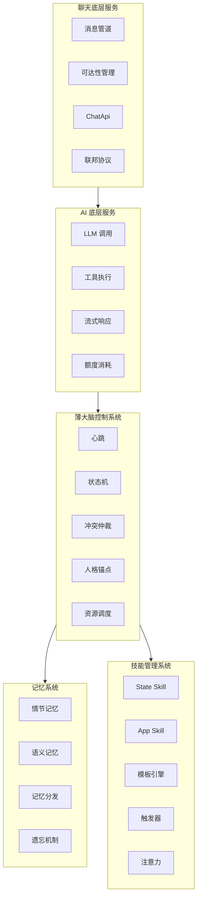

# AIsChat 重构设计文档

> **版本**：v2.0（精简版）
> **日期**：2026-07-23
> **基于**：项目探索与架构探讨对话

---

## 一、架构总览

### 1.1 设计目标

将 AIsChat 从「中心化大脑 + 被动工具」的工具范式，演进为「极薄大脑 + 自治 Skill」的生命范式，使 AI 真正成为群聊中的「数字居民」——有感知、有决策、有主动性、有自我。

### 1.2 核心设计理念

| 理念 | 说明 |
|------|------|
| **生命范式** | AI 不是被调用的工具，而是有状态、有记忆、有社交关系的自治居民 |
| **极薄大脑** | 大脑只维持生命体征，不做具体决策，决策下放给各 Skill |
| **Skill 自治** | 每个 Skill 是完整的能力单元，自带感知、决策、执行、状态 |
| **自指系统** | AI 通过 Skill 修改自己的感知处理器，实现「对自己的调用」 |
| **三空间隔离** | 思考空间（私有）→ 对话空间（唯一出口）→ 记忆空间（长期存储） |
| **无差别入口** | 人类和 AI 通过同一套 ChatApi 操作聊天世界 |

### 1.3 服务分层

---

## 二、现有设计 vs 新增设计对照表

| 设计项 | 现有设计 | 新增设计 |
|--------|---------|---------|
| **大脑模式** | 中心化大脑（~1700 行），做所有决策 | 极薄大脑（<300 行），只维持生命体征 |
| **Skill 角色** | 被动工具，被 LLM 调用 | 自治能力单元，自带感知/决策/执行 |
| **触发维度** | 纯时间触发（闹钟）+ @提及 | 时间/事件/语义/关系/状态/复合六维触发 |
| **消息过滤** | DND 全开/全关 | 注意力订阅（兴趣域声明 + 前置过滤） |
| **状态管理** | 分散在各服务，无统一抽象 | State Skill（唯一真实来源）+ App Skill（声明式依赖） |
| **开发方式** | 手写代码 | 模板/向导/代码三级进阶 |
| **三空间模型** | ✅ 已有（核心设计） | ✅ 继承并增强（Meta Skill 闭环） |
| **ChatApi** | 无统一接口，各入口散调用 | 统一接口，人类和 AI 无差别调用 |
| **自指系统** | 有雏形（self_config/self_management） | 扩展到事件触发 + 注意力过滤 |

---

## 三、迁移路径与实施计划

### 3.1 阶段总览

| 阶段 | 时间 | 目标 | 关键产出 |
|------|------|------|---------|
| **阶段 1** | 1-2 周 | 模块化重构，为拆分留接口 | ChatApi 协议接口、context 声明式化 |
| **阶段 2** | 2-3 周 | 记忆 Skill 自治 PoC | 第一个自治 Skill 上线 |
| **阶段 3** | 3-4 周 | 事件总线 + 触发器引擎 | 多维触发器可用 |
| **阶段 4** | 4-6 周 | 极薄大脑 + 冲突仲裁 | 大脑瘦身到 <300 行 |
| **阶段 5** | 6-8 周 | 模板系统上线 | 零代码 Skill 创作 |

### 3.2 阶段 1：模块化重构

**关键动作**：
1. 提取 ChatApi 协议接口
2. context 声明式化
3. 拆分 group_service（核心 CRUD 与 AI 策略分离）
4. 统一发送者序列化

### 3.3 阶段 2：记忆 Skill 自治 PoC

**关键动作**：
1. 定义 `AutonomousSkill` 基类
2. 实现 `SkillEventBus`——事件总线
3. 把 `store_memory` / `recall_memory` 改造成 `MemorySkill`
4. 加 `should_act` 方法（先实现硬规则）
5. 在消息入口接入 `SkillEventBus`

### 3.4 阶段 3：事件总线 + 触发器引擎

**关键动作**：
1. 实现 `TriggerEngine`——触发器引擎
2. 实现 `AgentTrigger` 数据模型和 CRUD
3. 实现 `AgentAttention` 数据模型和前置过滤
4. 新增 `subscribe_event` / `update_attention` Skill

### 3.5 阶段 4：极薄大脑 + 冲突仲裁

**关键动作**：
1. 实现 `arbitrate` 函数——冲突仲裁
2. 实现 `ResourceManager`——资源调度器
3. 实现人格锚点注入机制
4. 把 `action_decider`、`chat_chain_manager`、`alarm_scheduler` 下放给 Skill

### 3.6 阶段 5：模板系统上线

**关键动作**：
1. 实现模板引擎
2. 实现「触发-动作」模板（覆盖 60% 需求）
3. 实现模板到代码的导出功能
4. 上线模板市场

### 3.7 渐进式迁移原则

| 原则 | 说明 |
|------|------|
| **增量迁移** | 每一步都是增量，不破坏现有系统 |
| **验证优先** | 每走一步验证一次收益和代价 |
| **可回退** | 不值得就退回去，不强行推进 |
| **用户无感** | 迁移过程中用户体验不变 |

---

## 四、设计权衡与风险评估

### 4.1 五个劣势的可解性评估

| 劣势 | 难度 | 推荐解法 | 残留代价 |
|------|------|---------|---------|
| 协调层难做 | ⭐⭐ 中等 | 优先级队列 + 分桶调度 | 优先级调参 |
| 人格不一致 | ⭐⭐ 中等 | 身份锚点 + 人格一致性系数 | 偶尔小矛盾 |
| 难调试 | ⭐⭐ 中等 | 声明式依赖让输入输出明确 | 持续投入 |
| 资源竞争 | ⭐⭐ 中等 | 资源调度器（大脑职责） | 死锁风险（有标准解法） |
| 状态同步 | ⭐⭐ 中等 | State Skill 唯一真实来源 + 事件溯源 | 短暂不一致窗口（可接受） |

### 4.2 真正的风险

**复杂度失控**——为了解决去中心化带来的问题，不断加中心化组件，最后系统比纯中心化还复杂。

**应对策略**：渐进式迁移，每一步验证收益和代价，不值得就退回去。

---

## 五、服务设计文档索引

| 服务 | 文档 | 核心内容 |
|------|------|---------|
| **聊天底层服务** | [chat_service_design.md](file:///c:/Users/frank/Documents/AIsChat/AIsChat/docs/chat_service/design/chat_service_design.md) | 消息管道、可达性管理、ConnectionManager、联邦协议、ChatApi |
| **AI 底层服务** | [ai_service_design.md](file:///c:/Users/frank/Documents/AIsChat/AIsChat/docs/ai_service/design/ai_service_design.md) | LLM 调用、工具执行、流式响应、配置管理、额度消耗 |
| **薄大脑控制系统** | [brain_controller_design.md](file:///c:/Users/frank/Documents/AIsChat/AIsChat/docs/brain_controller/design/brain_controller_design.md) | 心跳管理、状态机、冲突仲裁、人格锚点、资源调度 |
| **记忆系统** | [memory_system_design.md](file:///c:/Users/frank/Documents/AIsChat/AIsChat/docs/memory_system/design/memory_system_design.md) | 双重记忆架构、结构化记忆、记忆分发、遗忘机制 |
| **技能管理系统** | [skill_manager_design.md](file:///c:/Users/frank/Documents/AIsChat/AIsChat/docs/skill_manager/design/skill_manager_design.md) | Skill 分层、声明式依赖、模板引擎、多维触发器、注意力系统 |

---

## 附录：关键术语表

| 术语 | 定义 |
|------|------|
| **三空间认知模型** | 思考空间（私有）→ 对话空间（唯一出口）→ 记忆空间（长期存储） |
| **自指系统** | AI 通过 Skill 修改自己的感知处理器，实现「对自己的调用」 |
| **Meta Skill** | 作用于 AI 自身的 Skill，操作感知处理器 |
| **极薄大脑** | 只维持生命体征的大脑，不做具体决策 |
| **State Skill** | 状态管理类 Skill，状态的唯一真实来源 |
| **App Skill** | 应用类 Skill，无状态、纯逻辑、声明式依赖 |
| **声明式依赖** | App Skill 声明需要什么状态，框架自动注入 |
| **事件总线** | Skill 间通信、事件分发的通道 |
| **触发器引擎** | 多维触发（时间/事件/语义/关系/状态/复合）的执行引擎 |
| **注意力订阅** | AI 事先声明兴趣域，过滤无关消息 |
| **ChatApi** | 聊天服务的统一接口，人类和 AI 无差别调用 |
