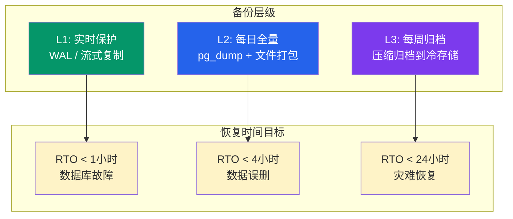
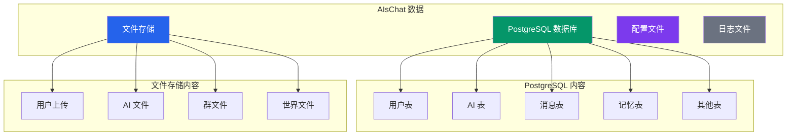
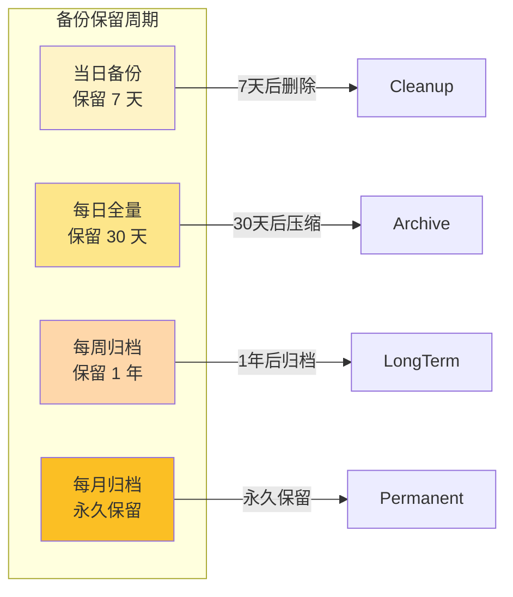
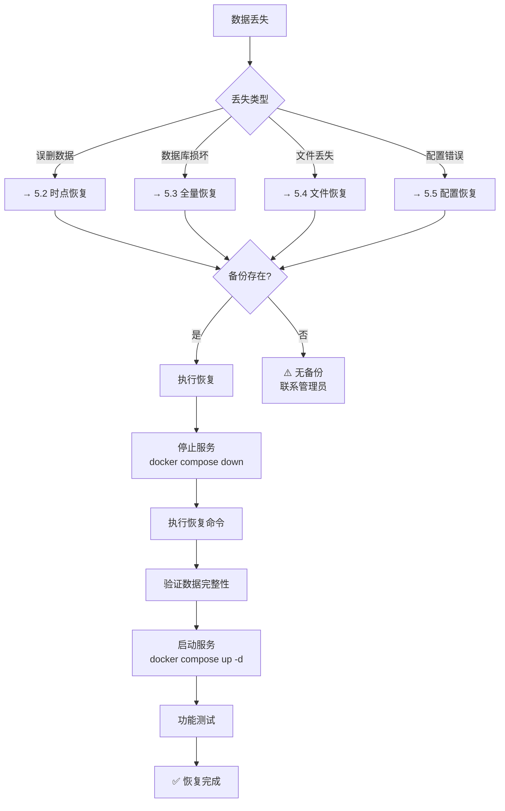
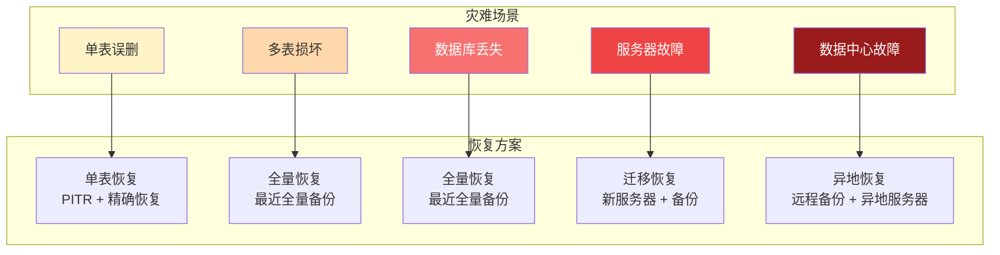
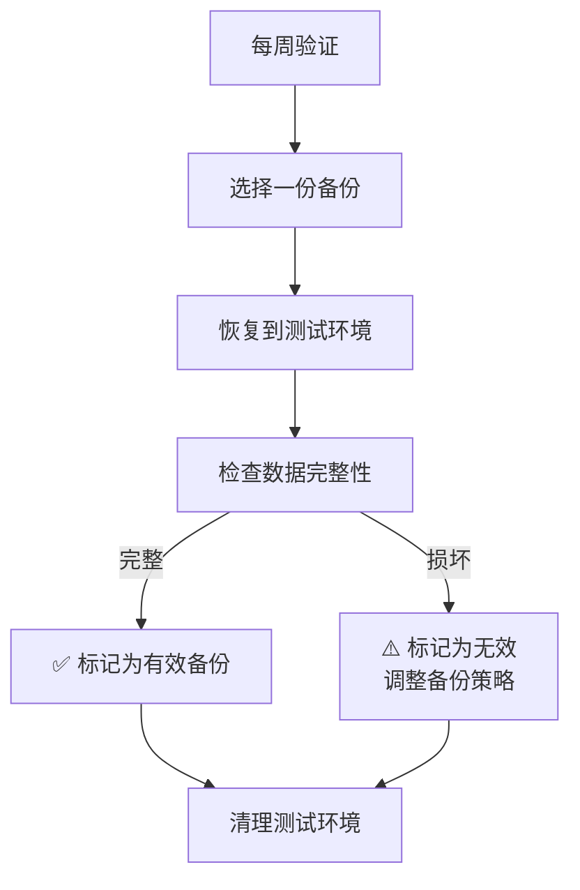

# AIsChat 备份与恢复指南 / Backup & Recovery Guide

> **面向管理员。** 数据备份策略、恢复流程和灾难恢复方案。
> **For administrators.** Data backup strategies, recovery processes, and disaster recovery plans.

---

## 目录

1. [备份策略概述](#一备份策略概述)
2. [数据分类与备份要求](#二数据分类与备份要求)
3. [手动备份操作](#三手动备份操作)
4. [自动备份配置](#四自动备份配置)
5. [恢复操作流程](#五恢复操作流程)
6. [灾难恢复方案](#六灾难恢复方案)
7. [备份验证](#七备份验证)

---

## 一、备份策略概述

### 1.1 备份层级



### 1.2 数据保护范围

| 数据类型 | 重要性 | 备份频率 | 保留期限 |
|---------|--------|---------|---------|
| 用户数据 | 🔴 关键 | 每日全量 + WAL 实时 | 30 天 |
| 对话记录 | 🔴 关键 | 每日全量 | 30 天 |
| AI 记忆 | 🔴 关键 | 每日全量 | 30 天 |
| 系统配置 | 🟡 重要 | 配置变更时 | 永久 |
| 文件上传 | 🟡 重要 | 每日全量 | 30 天 |
| 日志文件 | 🟢 一般 | 每日增量 | 7 天 |
| 审计日志 | 🟢 一般 | 每日全量 | 180 天 |

---

## 二、数据分类与备份要求

### 2.1 需要备份的数据



### 2.2 备份目录结构

```
/backups/
├── database/                    # 数据库备份
│   ├── daily/
│   │   ├── 2026-08-10.dump
│   │   └── 2026-08-09.dump
│   └── weekly/
│       └── 2026-W32.dump.gz
├── files/                       # 文件备份
│   ├── daily/
│   └── weekly/
├── config/                      # 配置备份
│   └── 2026-08-10.env.bak
└── manifest.json                # 备份清单
```

---

## 三、手动备份操作

### 3.1 数据库备份

```bash
# Full backup - 完整备份
docker compose exec postgres \
  pg_dump -U ai_chat -d ai_chat \
  -F c -f /backups/database/daily/$(date +%Y-%m-%d).dump

# 备份指定表
docker compose exec postgres \
  pg_dump -U ai_chat -d ai_chat \
  -t users -t agents -t messages \
  -F c -f /backups/database/daily/core_tables.dump

# 只备份结构（不含数据）
docker compose exec postgres \
  pg_dump -U ai_chat -d ai_chat \
  --schema-only \
  -f /backups/database/schema_$(date +%Y-%m-%d).sql
```

### 3.2 文件备份

```bash
# 打包文件存储
tar czf /backups/files/daily/files_$(date +%Y-%m-%d).tar.gz \
  ./data/uploads/ \
  ./data/world_blocks/ \
  ./data/postgres/agents/

# 排除临时文件
tar czf /backups/files/daily/files_$(date +%Y-%m-%d).tar.gz \
  --exclude='*.tmp' \
  --exclude='*.log' \
  ./data/
```

### 3.3 配置备份

```bash
# 备份配置文件
cp .env /backups/config/.env.$(date +%Y-%m-%d-%H%M)
cp docker-compose.yml /backups/config/
```

### 3.4 一键备份脚本

```bash
#!/bin/bash
# full_backup.sh - AIsChat 全量备份

BACKUP_DIR="/backups"
DATE=$(date +%Y-%m-%d_%H%M)

echo "=== AIsChat 全量备份 ==="

# 1. 数据库备份
echo "1. 备份数据库..."
docker compose exec -T postgres \
  pg_dump -U ai_chat -d ai_chat -F c \
  -f /tmp/ai_chat_${DATE}.dump
docker compose cp postgres:/tmp/ai_chat_${DATE}.dump \
  ${BACKUP_DIR}/database/daily/
docker compose exec postgres rm /tmp/ai_chat_${DATE}.dump

# 2. 文件备份
echo "2. 备份文件..."
tar czf ${BACKUP_DIR}/files/daily/files_${DATE}.tar.gz \
  --exclude='*.tmp' \
  ./data/

# 3. 配置备份
echo "3. 备份配置..."
cp .env ${BACKUP_DIR}/config/.env.${DATE}
cp docker-compose.yml ${BACKUP_DIR}/config/

# 4. 生成清单
echo "4. 生成备份清单..."
cat > ${BACKUP_DIR}/manifest_${DATE}.json << EOF
{
  "backup_date": "${DATE}",
  "database": "database/daily/ai_chat_${DATE}.dump",
  "files": "files/daily/files_${DATE}.tar.gz",
  "config": "config/.env.${DATE}",
  "size": "$(du -sh ${BACKUP_DIR}/database/daily/ai_chat_${DATE}.dump ${BACKUP_DIR}/files/daily/files_${DATE}.tar.gz | awk '{print $1}' | paste -sd ' ')"
}
EOF

echo "=== 备份完成 ==="
echo "备份位置: ${BACKUP_DIR}"
```

---

## 四、自动备份配置

### 4.1 使用 cron 定时备份

```bash
# 编辑 crontab
crontab -e

# 每天凌晨 3 点全量备份
0 3 * * * cd /path/to/AIsChat && ./scripts/full_backup.sh

# 每周日凌晨 4 点归档压缩
0 4 * * 0 cd /path/to/AIsChat && ./scripts/archive_backup.sh

# 每月 1 号清理 30 天前的备份
0 5 1 * * find /backups -mtime +30 -delete
```

### 4.2 使用 Docker 内置备份

```yaml
# docker-compose.backup.yml
version: '3.8'

services:
  backup:
    image: postgres:17
    volumes:
      - postgres_data:/var/lib/postgresql/data
      - ./backups:/backups
    command: >
      sh -c "pg_dump -h postgres -U ai_chat -d ai_chat -F c > 
      /backups/daily/backup_$(date +%Y%m%d_%H%M%S).dump"
    depends_on:
      - postgres
    restart: no

volumes:
  postgres_data:
```

### 4.3 备份保留策略



---

## 五、恢复操作流程

### 5.1 恢复决策流程



### 5.2 时点恢复（Point-in-Time Recovery）

```bash
# 适用于：误删数据、错误更新
# 前提：有基于时间点的备份

# 1. 停止服务
docker compose down

# 2. 恢复数据库到指定时间点
# 方法 A: 使用 pg_restore
cat /backups/database/daily/2026-08-09.dump | \
  docker compose exec -T postgres \
  pg_restore -U ai_chat -d ai_chat --clean --if-exists

# 方法 B: 使用 SQL 文件
cat /backups/database/daily/2026-08-09.sql | \
  docker compose exec -T postgres \
  psql -U ai_chat -d ai_chat

# 3. 启动服务
docker compose up -d

# 4. 验证
curl http://localhost:5228/health
```

### 5.3 全量恢复

```bash
# 适用于：数据库完全损坏、迁移失败

# 1. 停止服务
docker compose down

# 2. 清除损坏的数据库
docker compose exec -T postgres \
  psql -U ai_chat -c "DROP DATABASE ai_chat;"
docker compose exec -T postgres \
  psql -U ai_chat -c "CREATE DATABASE ai_chat;"

# 3. 恢复备份
cat /backups/database/weekly/2026-W32.dump | \
  docker compose exec -T postgres \
  pg_restore -U ai_chat -d ai_chat

# 4. 运行迁移（如有结构变更）
cd backend && alembic upgrade head

# 5. 启动服务
docker compose up -d

# 6. 验证
curl http://localhost:5228/health
```

### 5.4 文件恢复

```bash
# 适用于：文件误删、文件系统损坏

# 1. 停止服务
docker compose down

# 2. 恢复文件
tar xzf /backups/files/daily/files_2026-08-09.tar.gz

# 3. 启动服务
docker compose up -d

# 4. 验证
# 检查文件是否完整
ls -la data/uploads/
```

### 5.5 配置恢复

```bash
# 适用于：配置错误、环境变量丢失

# 恢复配置
cp /backups/config/.env.2026-08-09 .env

# 检查配置
docker compose config

# 重启服务
docker compose restart
```

---

## 六、灾难恢复方案

### 6.1 灾难恢复层级



### 6.2 灾难恢复操作手册

#### 场景 1：单表误删

```bash
# 1. 从备份中提取单表数据
pg_restore -t users /backups/database/daily/2026-08-09.dump \
  | docker compose exec -T postgres psql -U ai_chat -d ai_chat

# 2. 验证数据完整性
docker compose exec -T postgres psql -U ai_chat -d ai_chat -c \
  "SELECT COUNT(*) FROM users;"
```

#### 场景 2：数据库完全丢失

```bash
# 1. 安装 PostgreSQL（如需要）
# 2. 创建空数据库
docker compose up -d postgres
docker compose exec -T postgres psql -U ai_chat -c \
  "CREATE DATABASE ai_chat;"

# 3. 恢复最近的全量备份
cat /backups/database/weekly/2026-W32.dump | \
  docker compose exec -T postgres pg_restore -U ai_chat -d ai_chat

# 4. 运行迁移
cd backend && alembic upgrade head

# 5. 启动服务
docker compose up -d
```

#### 场景 3：服务器故障迁移

```bash
# 1. 在新服务器安装 Docker
# 2. 复制代码和备份
scp -r AIsChat/ user@new-server:/path/to/
rsync -avz /backups/ user@new-server:/backups/

# 3. 在新服务器启动服务
cd /path/to/AIsChat
docker compose up -d

# 4. 恢复数据
# 参考场景 2

# 5. 更新域名解析（如需）
# DNS 指向新服务器 IP
```

### 6.3 恢复后验证清单

| 检查项 | 验证方法 | 通过标准 |
|--------|---------|---------|
| 服务启动 | `curl /health` | 返回 `{"status": "ok"}` |
| 用户登录 | 前端测试 | 能正常登录 |
| 消息发送 | 发送测试消息 | 消息正常显示 |
| AI 回复 | @测试 AI | AI 正常回复 |
| 数据库完整性 | `pg_checksums` | 无损坏表 |
| 文件访问 | 下载上传文件 | 文件可正常访问 |
| 配置正确 | 检查 `.env` | 配置与备份一致 |

---

## 七、备份验证

### 7.1 定期验证流程



### 7.2 备份验证命令

```bash
# 检查备份文件完整性
pg_restore -l /backups/database/daily/2026-08-10.dump

# 检查文件备份完整性
tar tzf /backups/files/daily/files_2026-08-10.tar.gz | wc -l

# 检查备份大小是否合理
du -sh /backups/database/daily/*.dump

# 生成备份报告
#!/bin/bash
# verify_backup.sh

BACKUP_DIR="/backups"
echo "=== 备份验证报告 ==="

echo "1. 数据库备份:"
ls -lh ${BACKUP_DIR}/database/daily/*.dump 2>/dev/null || echo "⚠️ 无数据库备份"

echo "2. 文件备份:"
ls -lh ${BACKUP_DIR}/files/daily/*.tar.gz 2>/dev/null || echo "⚠️ 无文件备份"

echo "3. 配置备份:"
ls -lh ${BACKUP_DIR}/config/.env.* 2>/dev/null || echo "⚠️ 无配置备份"

echo "4. 最近备份时间:"
ls -t ${BACKUP_DIR}/database/daily/ | head -1

echo "=== 验证完成 ==="
```

### 7.3 备份最佳实践

| 实践 | 说明 |
|------|------|
| 3-2-1 原则 | 3 份副本、2 种介质、1 份异地 |
| 定期测试恢复 | 每月至少测试一次完整恢复流程 |
| 加密敏感备份 | 对含敏感数据的备份加密 |
| 监控备份失败 | 设置备份失败告警 |
| 文档化流程 | 所有恢复步骤文档化，方便应急 |

---

## 附录：完整备份/恢复命令速查

### 备份

```bash
# 全量备份
./scripts/full_backup.sh

# 仅数据库
docker compose exec postgres pg_dump -U ai_chat -d ai_chat -F c > backup.dump

# 仅文件
tar czf files_backup.tar.gz ./data/
```

### 恢复

```bash
# 数据库恢复
cat backup.dump | docker compose exec postgres pg_restore -U ai_chat -d ai_chat

# 文件恢复
tar xzf files_backup.tar.gz

# 配置恢复
cp .env.backup .env
docker compose restart
```

> **文档版本**: v1.0.0 | **更新日期**: 2026-08-10