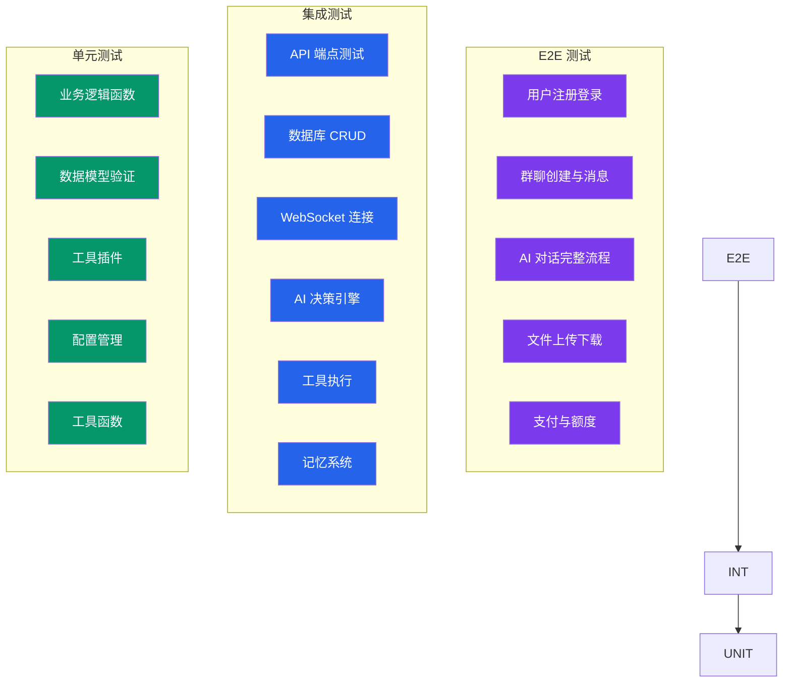
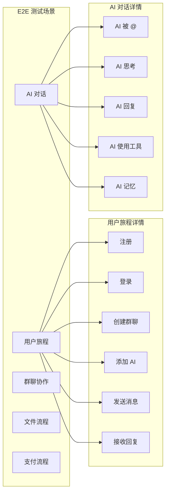
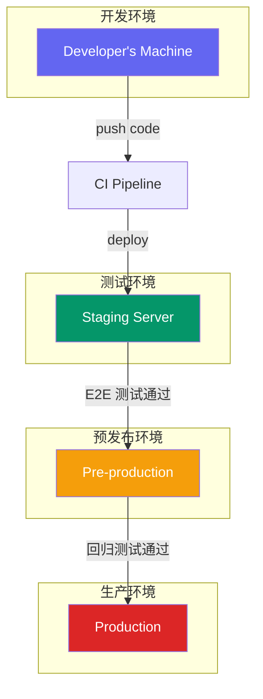
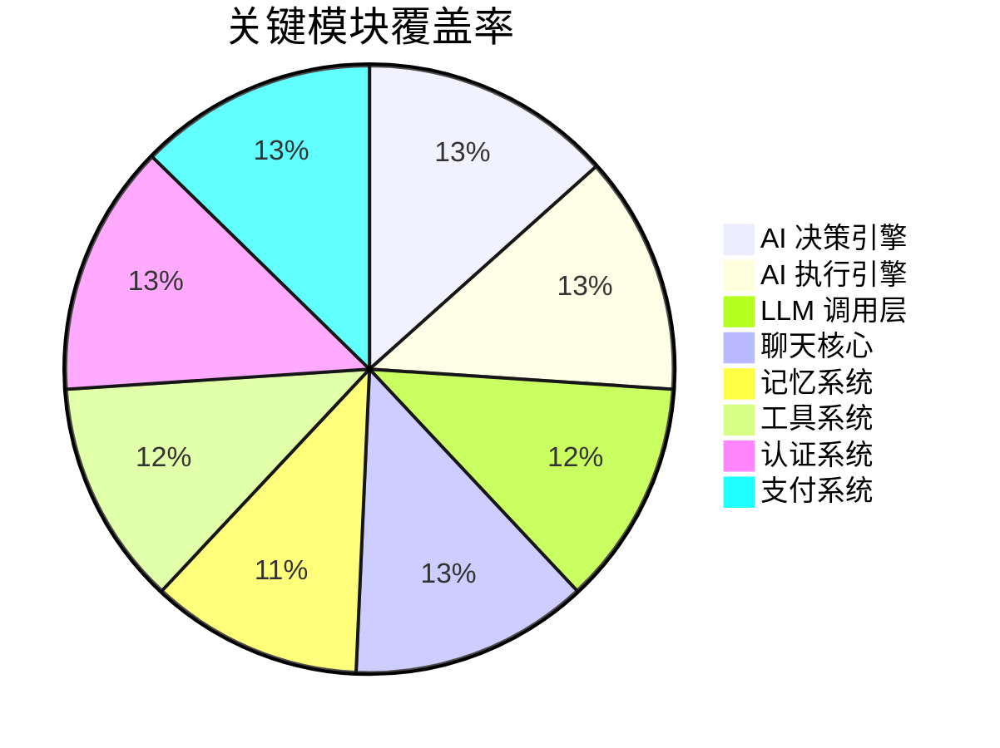
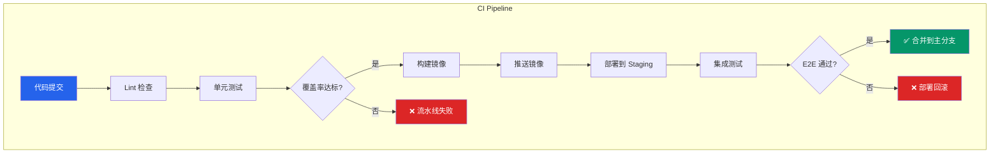

# AIsChat 测试策略文档 / Testing Strategy

> **面向开发者和质量保证人员。** 多层次测试策略、测试规范和质量标准。
> **For developers and QA.** Multi-level testing strategy, test standards, and quality criteria.

---

## 目录

1. [测试策略概述](#一测试策略概述)
2. [测试金字塔](#二测试金字塔)
3. [单元测试](#三单元测试)
4. [集成测试](#四集成测试)
5. [端到端测试](#五端到端测试)
6. [性能测试](#六性能测试)
7. [测试环境](#七测试环境)
8. [测试覆盖率要求](#八测试覆盖率要求)
9. [CI/CD 集成](#九cicd-集成)

---

## 一、测试策略概述

### 1.1 测试分层模型

```mermaid
flowchart TD
    subgraph "测试金字塔"
        E2E[端到端测试<br/>E2E Tests]
        Integration[集成测试<br/>Integration Tests]
        Unit[单元测试<br/>Unit Tests]
    end
    
    subgraph "数量比例"
        E2ERatio[~5%]
        IntegrationRatio[~20%]
        UnitRatio[~75%]
    end
    
    subgraph "执行速度"
        E2ESpeed[慢 (分钟级)]
        IntegrationSpeed[中等 (秒级)]
        UnitSpeed[快 (毫秒级)]
    end
    
    subgraph "维护成本"
        E2ECost[高]
        IntegrationCost[中]
        UnitCost[低]
    end
    
    E2E --> E2ERatio
    Integration --> IntegrationRatio
    Unit --> UnitRatio
    
    E2E --> E2ESpeed
    Integration --> IntegrationSpeed
    Unit --> UnitSpeed
    
    E2E --> E2ECost
    Integration --> IntegrationCost
    Unit --> UnitCost
    
    style E2E fill:#7c3aed,color:#fff
    style Integration fill:#2563eb,color:#fff
    style Unit fill:#059669,color:#fff
```

### 1.2 测试目标

| 维度 | 目标 | 衡量指标 |
|------|------|---------|
| 功能正确性 | 核心功能 100% 覆盖 | 需求覆盖率 |
| 回归稳定性 | 代码变更不破坏现有功能 | 回归测试通过率 |
| 性能满足 | 关键路径响应可接受 | P95 响应时间 |
| 安全性 | 无已知高危漏洞 | 安全扫描结果 |

---

## 二、测试金字塔



---

## 三、单元测试

### 3.1 测试范围

| 模块 | 测试重点 | 示例文件 |
|------|---------|---------|
| `app/ai/decider.py` | 决策逻辑、意愿分计算 | `tests/ai/test_decider.py` |
| `app/ai/executor.py` | 工具调用循环、上下文压缩 | `tests/ai/test_executor.py` |
| `app/ai/llm.py` | API Key 解析、消息构建 | `tests/ai/test_llm.py` |
| `app/tools/` | 工具参数校验、执行 | `tests/tools/test_weather.py` |
| `app/services/memory/` | 记忆检索、遗忘机制 | `tests/memory/test_memory.py` |
| `app/services/brain/` | 状态机转换、心跳 | `tests/brain/test_brain.py` |
| `app/chat/` | 消息管道、可达性 | `tests/chat/test_chat_api.py` |

### 3.2 单元测试示例

```python
# tests/ai/test_decider.py
import pytest
from app.ai.decider import decide_action, ActionType

class TestDecideAction:
    """测试 AI 决策逻辑"""
    
    @pytest.fixture
    def base_context(self):
        return {
            "event_type": "group_message",
            "agent_id": 1,
            "group_id": 7,
            "is_mentioned": False,
            "is_at_all": False,
            "idle_seconds": 30,
        }
    
    def test_agent_blocked_should_not_act(self, base_context):
        """AI 被封禁时不应回复"""
        context = {**base_context, "agent_state": "blocked"}
        result = decide_action(context)
        assert result.should_act is False
        assert result.reason == "agent blocked"
    
    def test_agent_dnd_with_mention_should_act(self, base_context):
        """DND 状态下被 @应该回复"""
        context = {**base_context, "agent_state": "dnd", "is_mentioned": True}
        result = decide_action(context)
        assert result.should_act is True
        assert result.action_type == ActionType.REPLY
    
    def test_low_willingness_should_skip(self, base_context):
        """意愿分低时应跳过"""
        context = {**base_context, "willingness_score": 5}
        result = decide_action(context)
        assert result.should_act is False
    
    def test_high_willingness_should_reply(self, base_context):
        """意愿分高时应回复"""
        context = {**base_context, "willingness_score": 80}
        result = decide_action(context)
        assert result.should_act is True
```

### 3.3 运行单元测试

```bash
# 运行所有单元测试
cd backend && python -m pytest tests/unit/ -v

# 运行特定模块测试
python -m pytest tests/unit/ai/test_decider.py -v

# 运行并显示覆盖率
python -m pytest tests/unit/ --cov=app --cov-report=term-missing

# 生成 HTML 覆盖率报告
python -m pytest tests/unit/ --cov=app --cov-report=html
```

---

## 四、集成测试

### 4.1 测试范围

| 集成场景 | 涉及模块 | 测试文件 |
|---------|---------|---------|
| REST API → 数据库 | 路由层 + ORM | `tests/integration/test_api/` |
| WebSocket → 消息广播 | WS + ConnectionManager | `tests/integration/test_ws/` |
| AI 决策 → LLM 调用 | Decider + LLM | `tests/integration/test_ai_flow/` |
| 工具执行 → 记忆存储 | Executor + Memory | `tests/integration/test_tool_flow/` |
| 联邦通信 | Federation 模块 | `tests/integration/test_federation/` |

### 4.2 API 集成测试示例

```python
# tests/integration/test_api/test_auth.py
import pytest
from fastapi.testclient import TestClient

class TestAuthAPI:
    """认证相关 API 集成测试"""
    
    def test_register_user_success(self, client: TestClient):
        """用户注册成功"""
        response = client.post("/auth/register", json={
            "username": "testuser",
            "password": "testpass123",
            "email": "test@example.com"
        })
        assert response.status_code == 201
        data = response.json()
        assert "access_token" in data
        assert data["user"]["username"] == "testuser"
    
    def test_register_duplicate_username(self, client: TestClient):
        """重复用户名注册失败"""
        # 先注册一个用户
        client.post("/auth/register", json={
            "username": "duplicate",
            "password": "testpass123",
            "email": "first@example.com"
        })
        # 尝试注册相同用户名
        response = client.post("/auth/register", json={
            "username": "duplicate",
            "password": "testpass123",
            "email": "second@example.com"
        })
        assert response.status_code == 400
    
    def test_login_success(self, client: TestClient):
        """登录成功"""
        response = client.post("/auth/login", json={
            "username": "testuser",
            "password": "testpass123"
        })
        assert response.status_code == 200
        assert "access_token" in data
    
    def test_login_wrong_password(self, client: TestClient):
        """错误密码登录失败"""
        response = client.post("/auth/login", json={
            "username": "testuser",
            "password": "wrongpass"
        })
        assert response.status_code == 401
```

### 4.3 集成测试配置

```python
# tests/conftest.py
import pytest
from httpx import AsyncClient
from app.main import app
from app.database import async_session, init_db

@pytest.fixture
async def client():
    """创建测试客户端"""
    async with AsyncClient(app=app, base_url="http://test") as ac:
        yield ac

@pytest.fixture
async def db_session():
    """创建测试数据库会话"""
    async with async_session() as session:
        yield session
        await session.rollback()

@pytest.fixture
def auth_headers(client, test_user):
    """创建认证请求头"""
    response = client.post("/auth/login", json={
        "username": test_user.username,
        "password": "testpass123"
    })
    token = response.json()["access_token"]
    return {"Authorization": f"Bearer {token}"}
```

### 4.4 运行集成测试

```bash
# 运行所有集成测试
cd backend && python -m pytest tests/integration/ -v

# 运行特定 API 测试
python -m pytest tests/integration/test_api/ -v

# 指定测试环境
ENV=test python -m pytest tests/integration/ -v
```

---

## 五、端到端测试

### 5.1 关键业务链路



### 5.2 E2E 测试示例（Playwright）

```typescript
// frontend/e2e/chat.spec.ts
import { test, expect } from '@playwright/test';

test.describe('聊天功能', () => {
  test('用户可以发送消息', async ({ page }) => {
    // 1. 登录
    await page.goto('/login');
    await page.fill('input[name="username"]', 'testuser');
    await page.fill('input[name="password"]', 'testpass');
    await page.click('button[type="submit"]');
    
    // 2. 进入群聊
    await page.goto('/chat/7');
    
    // 3. 发送消息
    await page.fill('.message-input', '你好，AI！');
    await page.click('.send-button');
    
    // 4. 验证消息显示
    await expect(page.locator('.message:last-child')).toBeVisible();
    await expect(page.locator('.message:last-child .content')).toHaveText('你好，AI！');
  });
  
  test('AI 可以回复消息', async ({ page }) => {
    // ...
    // 验证 AI 回复
    await expect(page.locator('.message.ai-message:last-child')).toBeVisible({
      timeout: 10000
    });
  });
});
```

### 5.3 运行 E2E 测试

```bash
# 安装 Playwright
cd frontend && npx playwright install

# 运行 E2E 测试
npm run test:e2e

# 带浏览器界面运行
npx playwright test --headed

# 生成测试报告
npx playwright show-report
```

---

## 六、性能测试

### 6.1 性能测试矩阵

| 测试场景 | 工具 | 指标 | 通过标准 |
|---------|------|------|---------|
| API 响应时间 | Locust / wrk | P95 响应时间 | < 500ms |
| WebSocket 并发 | k6 | 同时在线用户 | > 1000 |
| AI 回复延迟 | 自定义脚本 | 端到端延迟 | < 5s |
| 数据库查询 | pgbench | QPS | > 1000 |
| 文件上传 | curl / wrk | 上传速度 | > 10MB/s |

### 6.2 API 性能测试示例

```python
# tests/performance/test_api_performance.py
from locust import HttpUser, task, between

class AIsChatUser(HttpUser):
    wait_time = between(1, 3)
    
    @task(3)
    def send_message(self):
        self.client.post("/chat/messages", json={
            "group_id": 7,
            "content": "性能测试消息"
        })
    
    @task(1)
    def get_messages(self):
        self.client.get("/chat/messages", params={
            "group_id": 7,
            "limit": 50
        })

class AIsChatLoadTest:
    """加载测试场景"""
    
    def test_100_concurrent_users(self):
        """100 并发用户测试"""
        # locust -f test_api_performance.py --users 100 --spawn-rate 10
    
    def test_1000_concurrent_users(self):
        """1000 并发用户测试"""
        # locust -f test_api_performance.py --users 1000 --spawn-rate 50
```

### 6.3 性能基准

```mermaid
bar-chart
    title API 响应时间基准 (P95)
    x-axis [消息发送, 消息查询, AI 回复, 用户登录]
    y-axis "响应时间 (ms)" 0 --> 1000
    bar [当前实现] 120, 80, 3500, 200
    bar [目标] 50, 30, 5000, 100
```

| 端点 | 当前 P95 | 目标 P95 | 状态 |
|------|---------|---------|------|
| POST /chat/messages | 120ms | 50ms | 可接受 |
| GET /chat/messages | 80ms | 30ms | 可接受 |
| AI 回复 (端到端) | 3500ms | 5000ms | ✅ 优于目标 |
| POST /auth/login | 200ms | 100ms | 可接受 |

---

## 七、测试环境

### 7.1 环境分层



### 7.2 环境配置

| 环境 | 数据库 | LLM Key | 用途 |
|------|--------|---------|------|
| 本地开发 | SQLite / PG Test | Mock | 单元测试 |
| Staging | 独立 PG | 测试 Key | 集成/E2E 测试 |
| Pre-production | 独立 PG | 生产 Key (限额) | 回归测试 |
| Production | 主 PG | 生产 Key | 正式服务 |

### 7.3 测试数据管理

```bash
# 创建测试数据
cd backend && python -m tests.setup_test_data

# 清理测试数据
python -m tests.cleanup_test_data

# 从生产数据脱敏复制
python -m tests.sync_production_data --sanitize
```

---

## 八、测试覆盖率要求

### 8.1 覆盖率标准

| 测试类型 | 目标覆盖率 | 最低覆盖率 | 关键模块 |
|---------|-----------|-----------|---------|
| 单元测试 | 80% | 60% | AI 核心: 90%+ |
| 集成测试 | 70% | 50% | API 端点: 100% |
| E2E 测试 | 核心链路 100% | 核心链路 100% | 所有业务链路 |

### 8.2 关键模块覆盖率



### 8.3 覆盖率工具

```bash
# 后端覆盖率
cd backend && pytest --cov=app --cov-report=term-missing

# 前端覆盖率
cd frontend && npm run test:coverage

# 生成对比报告
npm run coverage:compare
```

---

## 九、CI/CD 集成

### 9.1 CI 流水线



### 9.2 GitHub Actions 配置

```yaml
# .github/workflows/test.yml
name: Test Suite

on: [push, pull_request]

jobs:
  unit-test:
    runs-on: ubuntu-latest
    steps:
      - uses: actions/checkout@v4
      - uses: actions/setup-python@v5
        with:
          python-version: '3.12'
      - run: pip install -r backend/requirements.txt
      - run: cd backend && pytest tests/unit/ --cov=app --cov-fail-under=60
  
  integration-test:
    needs: unit-test
    runs-on: ubuntu-latest
    services:
      postgres:
        image: postgres:17
        env:
          POSTGRES_PASSWORD: test
        ports:
          - 5432:5432
    steps:
      - uses: actions/checkout@v4
      - run: cd backend && pytest tests/integration/
  
  e2e-test:
    needs: integration-test
    runs-on: ubuntu-latest
    steps:
      - uses: actions/checkout@v4
      - uses: actions/setup-node@v4
        with:
          node-version: '20'
      - run: cd frontend && npm install
      - run: npx playwright test
```

### 9.3 质量门禁

| 门禁 | 检查项 | 失败处理 |
|------|--------|---------|
| 代码风格 | ESLint / Ruff | ❌ 阻止合并 |
| 单元测试 | 60% 覆盖率 | ❌ 阻止合并 |
| 集成测试 | 全部通过 | ❌ 阻止合并 |
| E2E 测试 | 核心链路通过 | ❌ 阻止合并 |
| 性能基准 | 满足 P95 标准 | ⚠️ 警告通知 |
| 安全扫描 | 无高危漏洞 | ❌ 阻止合并 |

---

## 附录：测试清单模板

### 功能测试清单

| # | 功能点 | 测试用例 | 状态 | 备注 |
|---|--------|---------|------|------|
| 1 | 用户注册 | 正常注册/重复用户名/密码强度 | ✅/❌ | |
| 2 | 用户登录 | 正常登录/错误密码/Token 过期 | ✅/❌ | |
| 3 | 消息发送 | 文本/图片/文件/表情 | ✅/❌ | |
| 4 | AI 回复 | @AI/主动唤醒/工具调用 | ✅/❌ | |
| ... | ... | ... | ... | |

### 回归测试清单

| # | 场景 | 关联版本 | 上次测试 | 状态 |
|---|------|---------|---------|------|
| 1 | 创建群聊 | v0.1.0 | 2026-08-01 | ✅ |
| 2 | 添加 AI | v0.1.0 | 2026-08-01 | ✅ |
| 3 | AI 对话 | v0.1.5 | 2026-08-05 | ✅ |
| 4 | 记忆管理 | v0.2.0 | 2026-08-08 | ✅ |
| 5 | 群视界 | v0.3.0 | 2026-08-10 | ✅ |

> **文档版本**: v1.0.0 | **更新日期**: 2026-08-10