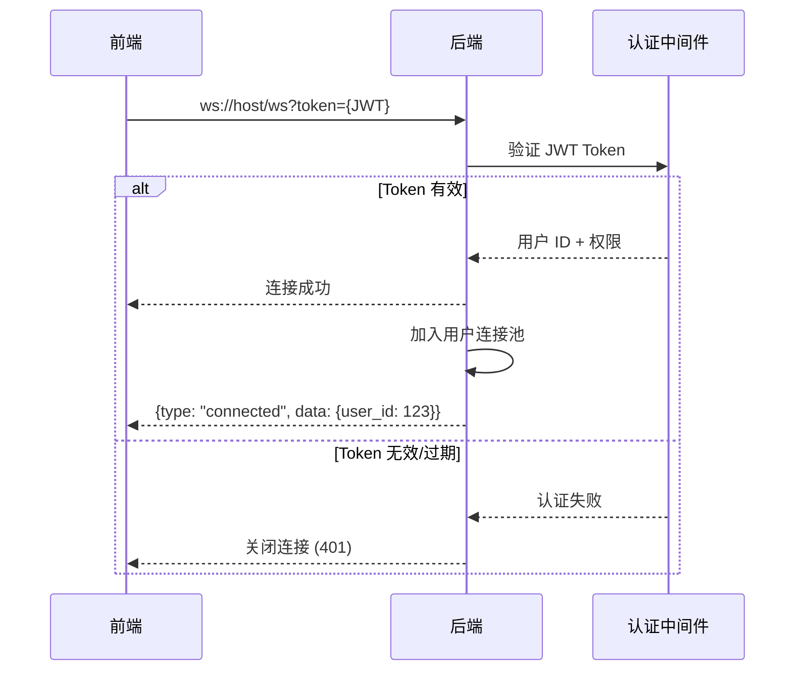
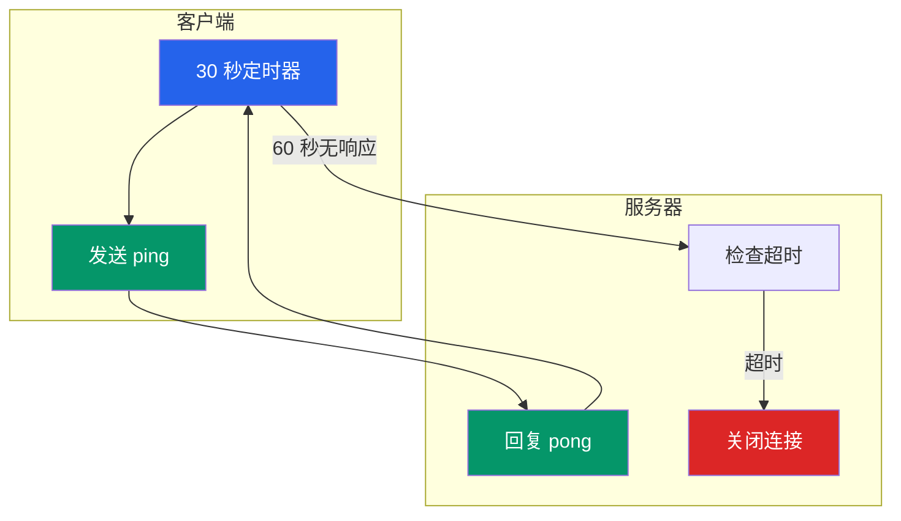
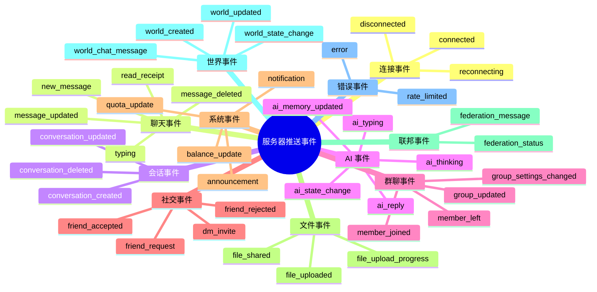
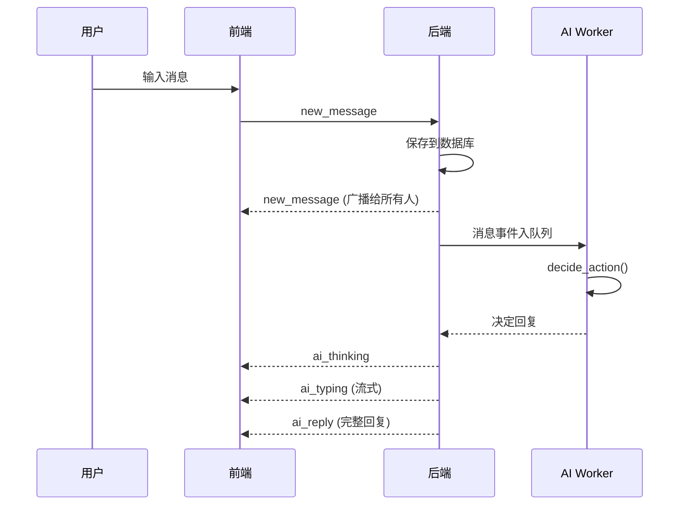
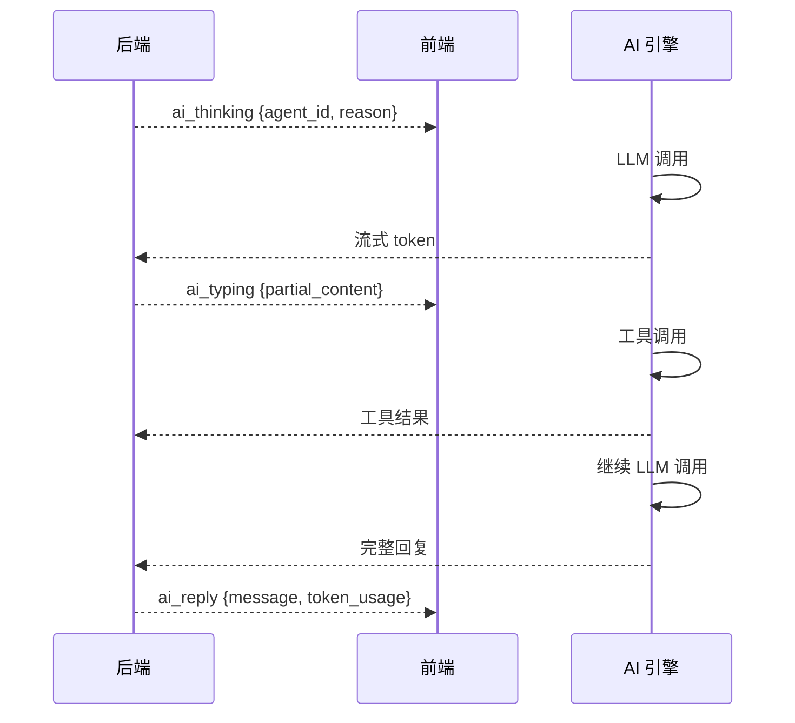
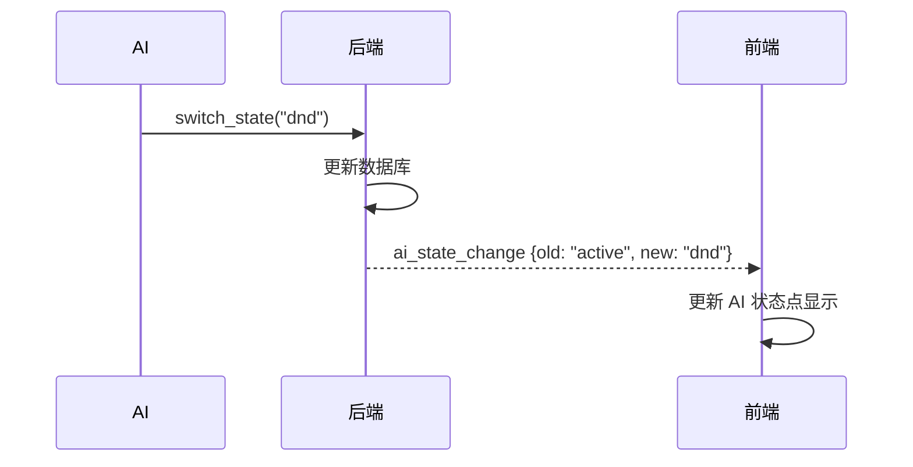
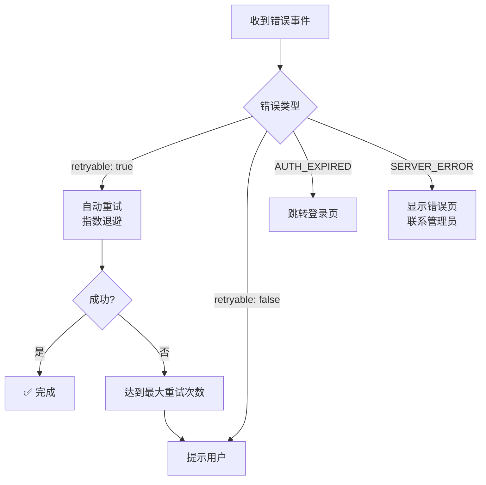

# AIsChat WebSocket 事件完整文档 / WebSocket Events Reference

> **面向前端开发者和集成开发者。** 所有 WebSocket 事件的详细说明。
> **For frontend and integration developers.** Detailed description of all WebSocket events.

---

## 目录

1. [连接协议](#一连接协议)
2. [消息格式规范](#二消息格式规范)
3. [服务器推送事件](#三服务器推送事件)
4. [客户端发送事件](#四客户端发送事件)
5. [事件流时序图](#五事件流时序图)
6. [错误事件处理](#六错误事件处理)

---

## 一、连接协议

### 1.1 建立连接



### 1.2 连接参数

| 参数 | 类型 | 必填 | 说明 |
|------|------|------|------|
| `token` | string | ✅ | JWT Access Token |
| `client_type` | string | ❌ | `web` / `desktop` / `mobile` |
| `version` | string | ❌ | 客户端版本号 |

### 1.3 心跳机制



| 行为 | 间隔 | 超时 |
|------|------|------|
| 客户端发送 `ping` | 30 秒 | - |
| 服务器回复 `pong` | 立即 | - |
| 服务器检测超时 | - | 60 秒无消息则断开 |

---

## 二、消息格式规范

### 2.1 统一消息结构

所有 WebSocket 消息遵循以下 JSON 结构：

```json
{
  "type": "事件类型",
  "data": {
    "payload": "事件数据",
    // ... 其他字段
  },
  "timestamp": 1234567890
}
```

### 2.2 通用字段

| 字段 | 类型 | 说明 |
|------|------|------|
| `type` | string | 事件类型标识 |
| `data` | object | 事件数据载荷 |
| `timestamp` | number | 服务器时间戳（毫秒） |
| `message_id` | string | 唯一消息 ID（可选） |

### 2.3 响应消息结构

```json
{
  "type": "事件类型_response",
  "data": {
    "success": true,
    "result": { ... },
    "error": null
  },
  "timestamp": 1234567890
}
```

---

## 三、服务器推送事件

### 3.1 事件分类



### 3.2 连接事件

#### `connected` — 连接建立成功

```json
{
  "type": "connected",
  "data": {
    "user_id": 123,
    "username": "张三",
    "session_id": "sess_abc123",
    "servers": {
      "websocket": "ws://host/ws",
      "api": "http://host/api"
    }
  },
  "timestamp": 1234567890
}
```

#### `disconnected` — 连接断开

```json
{
  "type": "disconnected",
  "data": {
    "reason": "server_shutdown",
    "code": 1000
  },
  "timestamp": 1234567890
}
```

| reason | 说明 |
|--------|------|
| `server_shutdown` | 服务器关闭 |
| `timeout` | 心跳超时 |
| `unauthorized` | 认证失败 |
| `client_closed` | 客户端主动关闭 |
| `error` | 发生错误 |

#### `reconnecting` — 重连中

```json
{
  "type": "reconnecting",
  "data": {
    "attempt": 1,
    "max_attempts": 5,
    "delay_ms": 1000
  }
}
```

### 3.3 聊天事件

#### `new_message` — 新消息到达

```json
{
  "type": "new_message",
  "data": {
    "message": {
      "id": 456,
      "content": "你好！",
      "message_type": "text",
      "sender_type": "human",
      "sender_id": 123,
      "sender_name": "张三",
      "sender_avatar": "/avatars/user123.jpg",
      "group_id": null,
      "dm_session_id": 12,
      "reply_to": null,
      "attachments": [],
      "created_at": "2026-08-10T10:30:00Z"
    }
  }
}
```

#### `typing` — 正在输入

```json
{
  "type": "typing",
  "data": {
    "user_id": 456,
    "group_id": 7,
    "is_typing": true
  }
}
```

#### `read_receipt` — 已读回执

```json
{
  "type": "read_receipt",
  "data": {
    "reader_id": 123,
    "message_id": 455,
    "read_at": "2026-08-10T10:35:00Z"
  }
}
```

### 3.4 AI 事件

#### `ai_thinking` — AI 正在思考

```json
{
  "type": "ai_thinking",
  "data": {
    "agent_id": 456,
    "agent_name": "逍遥三号",
    "reason": "正在分析问题...",
    "started_at": "2026-08-10T10:30:05Z"
  }
}
```

#### `ai_typing` — AI 正在输入

```json
{
  "type": "ai_typing",
  "data": {
    "agent_id": 456,
    "agent_name": "逍遥三号",
    "partial_content": "这是AI回复的一部分...",
    "is_streaming": true
  }
}
```

#### `ai_reply` — AI 完整回复

```json
{
  "type": "ai_reply",
  "data": {
    "agent_id": 456,
    "message": {
      "id": 457,
      "content": "这是完整的AI回复内容。",
      "message_type": "text",
      "sender_type": "ai",
      "sender_id": 456,
      "sender_name": "逍遥三号",
      "group_id": 7,
      "created_at": "2026-08-10T10:30:10Z"
    },
    "token_usage": {
      "prompt": 1500,
      "completion": 100,
      "total": 1600
    }
  }
}
```

#### `ai_state_change` — AI 状态变更

```json
{
  "type": "ai_state_change",
  "data": {
    "agent_id": 456,
    "previous_state": "active",
    "new_state": "dnd",
    "reason": "auto_dnd_threshold reached",
    "wake_at": null
  }
}
```

| state | 说明 |
|-------|------|
| `active` | 正常活跃 |
| `dnd` | 勿扰模式 |
| `inactive` | 离线/休眠 |
| `blocked` | 被封禁 |

### 3.5 会话事件

#### `conversation_created` — 会话创建

```json
{
  "type": "conversation_created",
  "data": {
    "conversation": {
      "id": 789,
      "type": "group",
      "name": "AI 研究所",
      "members": 5,
      "created_at": "2026-08-10T10:00:00Z"
    }
  }
}
```

### 3.6 系统事件

#### `notification` — 系统通知

```json
{
  "type": "notification",
  "data": {
    "notification": {
      "id": 101,
      "type": "friend_request",
      "title": "新的好友申请",
      "content": "李四 请求添加你为好友",
      "data": { "user_id": 456 },
      "is_read": false,
      "created_at": "2026-08-10T10:00:00Z"
    }
  }
}
```

#### `balance_update` — 余额变更

```json
{
  "type": "balance_update",
  "data": {
    "credit_type": "api_credit",
    "old_balance": 50,
    "new_balance": 48.5,
    "change": -1.5,
    "reason": "AI 调用消耗",
    "related_agent_id": 456
  }
}
```

### 3.7 错误事件

#### `error` — 通用错误

```json
{
  "type": "error",
  "data": {
    "code": "AGENT_BLOCKED",
    "message": "AI 已被封禁",
    "details": { "agent_id": 456 },
    "retryable": false
  }
}
```

#### `rate_limited` — 速率限制

```json
{
  "type": "rate_limited",
  "data": {
    "limit": 5,
    "current": 5,
    "reset_at": "2026-08-10T10:30:35Z",
    "retry_after_ms": 5000
  }
}
```

---

## 四、客户端发送事件

### 4.1 客户端事件列表

| 事件 | 说明 |
|------|------|
| `ping` | 心跳检测 |
| `read_message` | 标记消息已读 |
| `typing` | 正在输入状态 |
| `mark_all_read` | 标记所有消息已读 |

### 4.2 `ping` — 心跳

```json
{
  "type": "ping",
  "data": {
    "client_time": 1234567890
  }
}
```

### 4.3 `read_message` — 标记已读

```json
{
  "type": "read_message",
  "data": {
    "message_id": 456,
    "conversation_id": 789
  }
}
```

### 4.4 `mark_all_read` — 全部已读

```json
{
  "type": "mark_all_read",
  "data": {
    "conversation_id": 789
  }
}
```

---

## 五、事件流时序图

### 5.1 发送消息流程



### 5.2 AI 回复流程



### 5.3 状态变更流程



---

## 六、错误事件处理

### 6.1 常见错误码

| code | HTTP 状态 | 说明 | 处理建议 |
|------|---------|------|---------|
| `AGENT_BLOCKED` | - | AI 被封禁 | 联系管理员解封 |
| `AGENT_INACTIVE` | - | AI 离线 | 唤醒 AI 或 @提及 |
| `CREDIT_INSUFFICIENT` | - | 额度不足 | 充值或兑换码 |
| `RATE_LIMITED` | 429 | 触发速率限制 | 等待重试 |
| `TOOL_NOT_FOUND` | - | 工具不存在 | 检查工具名 |
| `CONNECTION_CLOSED` | - | 连接关闭 | 自动重连 |
| `AUTH_EXPIRED` | 401 | Token 过期 | 重新登录 |
| `SERVER_ERROR` | 500 | 服务器内部错误 | 查看日志 |

### 6.2 前端错误处理策略



### 6.3 重连策略

| 尝试次数 | 延迟 | 说明 |
|---------|------|------|
| 1 | 1 秒 | 立即重连 |
| 2 | 2 秒 | 指数退避 |
| 3 | 4 秒 | 指数退避 |
| 4 | 8 秒 | 指数退避 |
| 5 | 16 秒 | 指数退避 |
| > 5 | 30 秒 | 稳定重连间隔 |

```mermaid
gantt
    title WebSocket 重连退避
    dateFormat X
    axisFormat 秒
    
    section 重连尝试
    尝试1 :1, 2
    尝试2 :3, 5
    尝试3 :5, 9
    尝试4 :9, 17
    尝试5 :17, 33
    持续重连 :33, 63
```



---

## 附录：前端开发示例

### 监听消息事件

```javascript
// React Hook 示例
const useWebSocket = () => {
  const [messages, setMessages] = useState([]);
  
  useEffect(() => {
    const ws = new WebSocket(`ws://host/ws?token=${token}`);
    
    ws.onmessage = (event) => {
      const { type, data } = JSON.parse(event.data);
      
      switch (type) {
        case 'new_message':
          setMessages(prev => [...prev, data.message]);
          break;
        case 'ai_typing':
          // 更新 AI 输入状态
          break;
        case 'ai_reply':
          setMessages(prev => [...prev, data.message]);
          break;
        case 'ai_state_change':
          // 更新 AI 状态
          break;
        case 'balance_update':
          // 更新余额
          break;
      }
    };
    
    ws.onclose = () => {
      // 自动重连
    };
    
    return () => ws.close();
  }, []);
};
```

### 发送事件

```javascript
// 标记消息已读
ws.send(JSON.stringify({
  type: 'read_message',
  data: {
    message_id: 456,
    conversation_id: 789
  }
}));

// 心跳
ws.send(JSON.stringify({
  type: 'ping',
  data: {
    client_time: Date.now()
  }
}));
```

> **文档版本**: v1.0.0 | **更新日期**: 2026-08-10