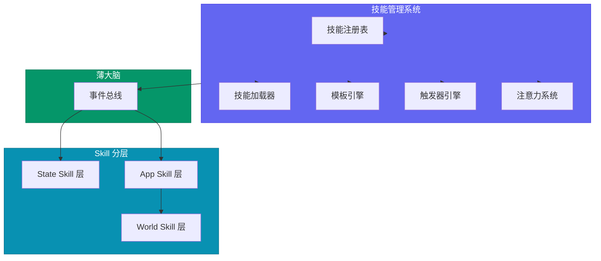
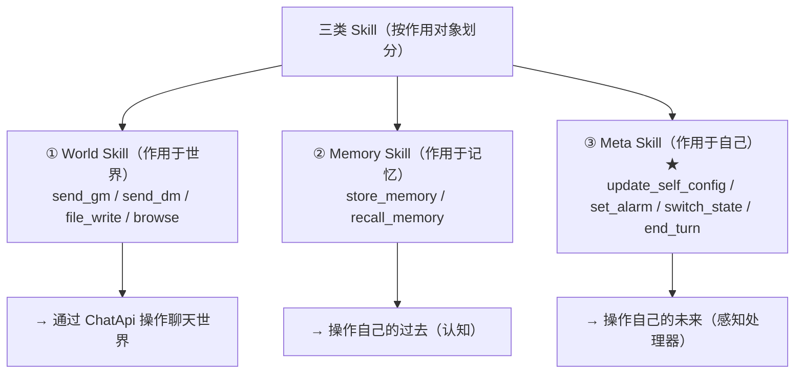
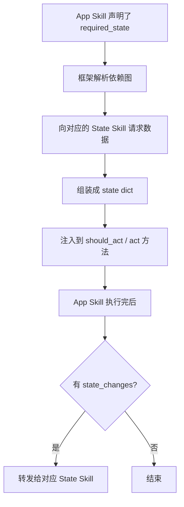
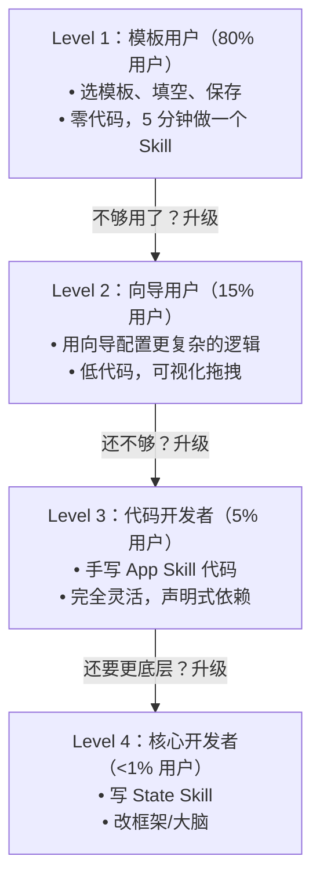
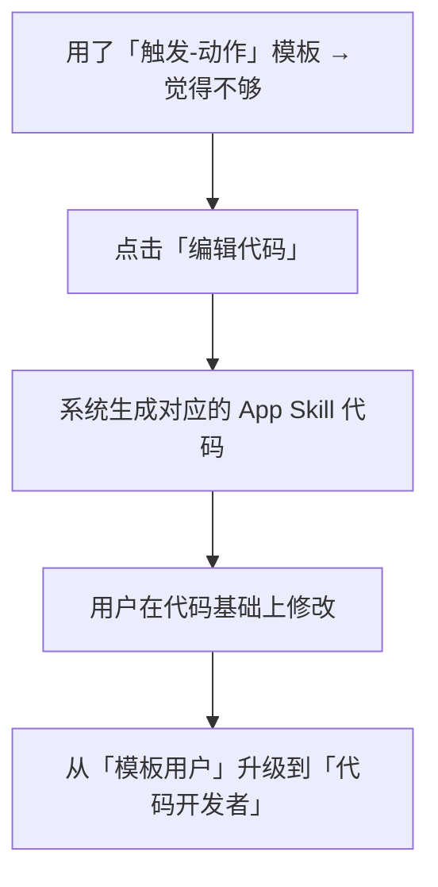
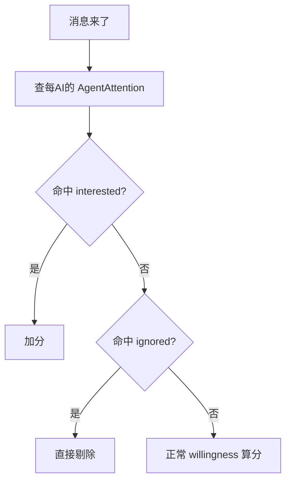

# AI 模块化技能管理系统设计文档

> **服务定位**：管理 AI 的自治技能，支持声明式依赖、模板创作、多维触发
> **版本**：v1.0
> **日期**：2026-07-23
> **文档规范**：设计类文档统一结构，语言规范，命名规范

---

## 目录

1. [服务架构](#一服务架构)
2. [核心设计理念](#二核心设计理念)
3. [Skill 分层模型](#三skill-分层模型)
4. [自治 Skill 基类设计](#四自治-skill-基类设计)
5. [声明式状态依赖](#五声明式状态依赖)
6. [模板/向导系统](#六模板向导系统)
7. [多维触发器](#七多维触发器)
8. [注意力系统](#八注意力系统)
9. [技能注册表](#九技能注册表)
10. [关键文件索引](#十关键文件索引)
11. [API 端点](#十一api-端点)

---

## 一、服务架构



---

## 二、核心设计理念

| 理念 | 说明 |
|------|------|
| **Skill 自治** | 每个 Skill 是完整的能力单元，自带感知、决策、执行、状态 |
| **声明式依赖** | App Skill 声明需要什么状态，框架自动注入 |
| **三层设计** | State Skill（状态管理）+ App Skill（应用逻辑）+ World Skill（世界操作） |
| **模板创作** | 零代码创作 Skill，80% 用户不用写代码 |
| **多维触发** | 时间/事件/语义/关系/状态/复合六维触发 |
| **注意力过滤** | AI 主动过滤消息，声明兴趣域 |

---

## 三、Skill 分层模型

### 3.1 三层定义



### 3.2 State Skill vs App Skill

| 类型 | State Skill（状态管理类） | App Skill（应用类） |
|------|-------------------------|-------------------|
| **职责** | 状态的唯一真实来源 | 无状态、纯逻辑 |
| **状态** | 有状态，自己管理 | 无状态，从 State Skill 获取 |
| **数量** | 少而精（~10 个以内） | 多而活（社区贡献） |
| **维护者** | 核心团队 | 社区/用户 |
| **API** | 提供状态读写接口 | 声明式依赖状态 |

### 3.3 State Skill 清单

| State Skill | 管理的状态 |
|------------|-----------|
| `memory_state` | 向量记忆、结构化记忆、文件 |
| `social_state` | 好友关系、群成员、社交圈 |
| `work_state` | 任务、工作区、当前进度 |
| `alarm_state` | 触发器、闹钟、定时任务 |
| `identity_state` | 人格锚点、身份设定、状态机 |

---

## 四、自治 Skill 基类设计

### 4.1 AutonomousSkill 基类

```python
class AutonomousSkill:
    name: str
    description: str
    segment: str
    
    subscribed_events: list[str] = []
    
    async def should_act(self, event: dict, state: dict) -> ActDecision:
        """
        返回决策：
        - should_act: bool
        - priority: int 0-100
        - action_type: "speak" | "remember" | "silent" | "internal"
        - reason: str
        """
        ...
    
    async def act(self, event: dict, decision: ActDecision, state: dict) -> SkillOutput:
        """
        执行动作，返回输出：
        - messages_to_send: list[Message]
        - state_changes: dict
        - memory_updates: list[Memory]
        - internal_log: str
        """
        ...
    
    async def load_state(self) -> dict: ...
    async def save_state(self, state: dict) -> None: ...
    
    resource_budget: dict = {
        "llm_tokens_per_day": 0,
        "messages_per_day": 0,
    }
```

### 4.2 App Skill 基类

```python
class AppSkill(AutonomousSkill):
    required_state: dict = {}
    
    async def should_act(self, event: dict, state: dict) -> ActDecision:
        # state 已经包含了 required_state 声明的所有状态
        ...
```

### 4.3 State Skill 基类

```python
class StateSkill(AutonomousSkill):
    async def get_state(self, query: dict) -> dict: ...
    async def update_state(self, updates: dict) -> dict: ...
    async def publish_state_change(self, change: dict) -> None: ...
```

---

## 五、声明式状态依赖

### 5.1 依赖声明示例

```python
class DailyGreetingSkill(AppSkill):
    name = "daily_greeting"
    description = "每天早上给好友发问候"
    segment = "social"
    
    subscribed_events = ["alarm_daily_morning"]
    
    required_state = {
        "memory": {
            "user_preferences": {"filter": "friends_only"},
            "recent_interactions": {"limit": 5, "days": 7},
        },
        "social": {
            "friend_list": {"status": "close"},
            "online_status": {"scope": "friends"},
        },
        "alarm": {
            "next_alarm": {"type": "daily_greeting"},
        },
    }
    
    resource_budget = {
        "llm_tokens_per_day": 500,
        "messages_per_day": 3,
    }
```

### 5.2 框架责任流程



### 5.3 声明式优势

| 方式 | 复杂度 | 优势 |
|------|--------|------|
| 自己调 State Skill API | 高 | 灵活 |
| 声明式依赖注入 | 低 | 缓存优化、预加载、权限控制 |

---

## 六、模板/向导系统

### 6.1 三种开发方式进阶路径



### 6.2 模板分类

#### 类型 A：触发-动作型模板（覆盖 60% 需求）

```
模板名：当 X 发生时做 Y

填空：
  □ 触发条件：[下拉选择]
     - 收到包含关键词 [___] 的消息
     - 好友 [___] 上线了
     - 每天 [___] 点
     - 群里有人 @我
  
  □ 执行动作：[下拉选择]
     - 回复消息：[___]
     - 存一条记忆：[___]
     - 设一个闹钟：[___] 分钟后
     - @某个人：[___]

  □ 附加条件（可选）：
     - 只在 [时间段] 生效
     - 每天最多 [___] 次
```

#### 类型 B：角色设定模板（覆盖 25% 需求）

```
模板名：定制一个 [角色] Skill

填空：
  □ 角色名称：[___]
  □ 角色描述：[___]
  □ 说话风格：[下拉选择]
  □ 触发方式：[下拉选择]
  □ 特殊能力：[多选]
```

#### 类型 C：工作流模板（覆盖 10% 需求）

```
模板名：多步骤任务流

可视化步骤：
  [步骤 1] 收到触发 → [步骤 2] 收集信息 → [步骤 3] 执行 → [步骤 4] 反馈结果
```

### 6.3 模板到代码的逃逸口



---

## 七、多维触发器

### 7.1 触发器分类

```mermaid
graph TD
    Trigger["AI 触发器（Trigger）—— 多维度"]
    
    Time["① 时间触发<br/>wake_at: datetime<br/>用途：定时任务"]
    Event["② 事件触发<br/>on_event: message_received | friend_online"]
    Semantic["③ 语义触发<br/>topic_match: \"Python\" | \"AI架构\""]
    Relational["④ 关系触发<br/>on_user_message: [friend_ids]"]
    State["⑤ 状态触发<br/>on_state_change: group_active"]
    Composite["⑥ 复合触发<br/>AND / OR 组合"]
    
    Trigger --> Time
    Trigger --> Event
    Trigger --> Semantic
    Trigger --> Relational
    Trigger --> State
    Trigger --> Composite
```

### 7.2 触发器数据模型

```python
class AgentTrigger(Base):
    id: int
    agent_id: int
    trigger_type: str              # time | event | semantic | relational | state | composite
    task: str                       # 触发后告诉 AI 要做什么
    status: str                     # pending | fired | cancelled
    expires_at: datetime | None
    max_fires: int                  # 1=一次性，-1=永久
    fire_count: int = 0
    condition: dict                 # 条件 payload
```

### 7.3 触发器引擎

```python
class TriggerEngine:
    async def register_trigger(self, agent_id: int, trigger: AgentTrigger) -> None: ...
    async def unregister_trigger(self, agent_id: int, trigger_id: int) -> None: ...
    async def check_triggers(self, event: dict) -> list[AgentTrigger]: ...
    async def fire_trigger(self, agent_id: int, trigger_id: int) -> None: ...
```

---

## 八、注意力系统

### 8.1 注意力数据模型

```python
class AgentAttention(Base):
    agent_id: int
    group_id: int | None
    
    interested_topics: list[str]    # ["Python", "AI架构"]
    interested_users: list[int]     # 好友/特定用户 ID
    interested_patterns: list[str]  # 正则模式
    
    ignored_topics: list[str]
    ignored_patterns: list[str]
    
    match_action: str               # highlight | wake | silent_remember
```

### 8.2 前置过滤流程



---

## 九、技能注册表

### 9.1 注册表接口

```python
class SkillRegistry:
    def register(self, skill_class: type[AutonomousSkill]) -> None: ...
    def get_skill(self, name: str) -> AutonomousSkill | None: ...
    def list_skills(self) -> list[str]: ...
    def list_skills_by_segment(self, segment: str) -> list[str]: ...
    def enable_skill(self, agent_id: int, skill_name: str) -> None: ...
    def disable_skill(self, agent_id: int, skill_name: str) -> None: ...
    def get_enabled_skills(self, agent_id: int) -> list[str]: ...
```

### 9.2 技能存储

```python
class AgentSkillRelation(Base):
    agent_id: int
    skill_name: str
    is_enabled: bool = True
    config: dict = {}
    created_at: datetime
    updated_at: datetime
```

---

## 十、关键文件索引

| 文件 | 职责 |
|------|------|
| `backend/app/services/skill_manager.py` | 技能管理核心 |
| `backend/app/services/skill_registry.py` | 技能注册表 |
| `backend/app/services/trigger_engine.py` | 触发器引擎 |
| `backend/app/services/attention_system.py` | 注意力系统 |
| `backend/app/services/template_engine.py` | 模板引擎 |
| `backend/app/skills/base.py` | AutonomousSkill 基类 |
| `backend/app/skills/state_skills/` | State Skill 实现 |
| `backend/app/skills/app_skills/` | App Skill 实现 |
| `backend/app/models/agent_trigger.py` | 触发器 ORM |
| `backend/app/models/agent_attention.py` | 注意力 ORM |
| `backend/app/models/agent_skill_relation.py` | 技能关联 ORM |

---

## 十一、API 端点

| 方法 | 路径 | 说明 |
|------|------|------|
| GET | `/skills` | 获取所有可用技能 |
| GET | `/skills/{name}` | 获取技能详情 |
| POST | `/skills/{agent_id}/enable/{name}` | 启用技能 |
| POST | `/skills/{agent_id}/disable/{name}` | 禁用技能 |
| POST | `/skills/{agent_id}/trigger` | 创建触发器 |
| GET | `/skills/{agent_id}/triggers` | 获取触发器列表 |
| DELETE | `/skills/{agent_id}/triggers/{id}` | 删除触发器 |
| POST | `/skills/{agent_id}/attention` | 更新注意力设置 |
| POST | `/skills/template/generate` | 从模板生成技能 |
